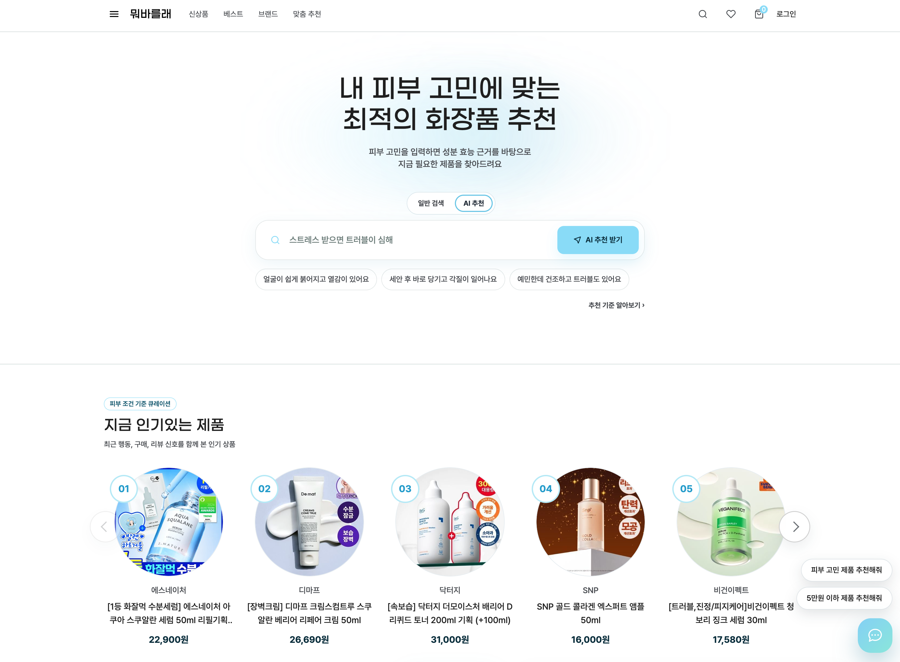
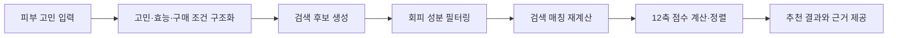
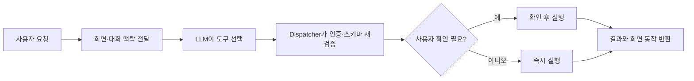
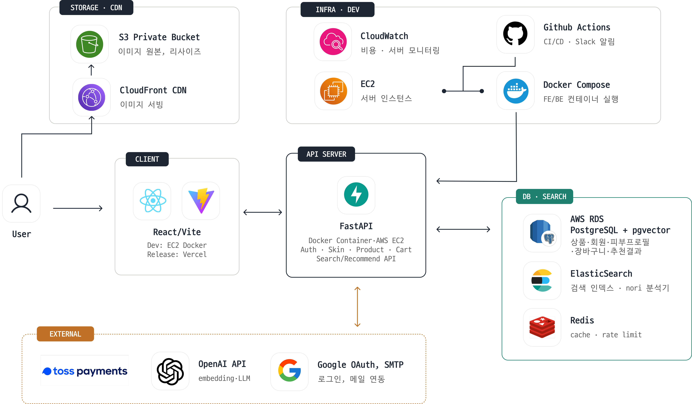
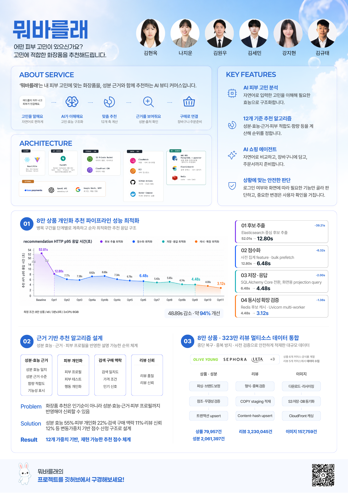

# 뭐바를래

> 피부 고민을 자연어로 이해하고, 성분 근거 기반 추천부터 비교·장바구니·주문 준비까지 연결하는 AI 뷰티 커머스 서비스

[](https://github.com/mwobareullae/jungle_namanmoo/actions/workflows/ci.yml)

[문서 길잡이](docs/README.md) · [Frontend](apps/frontend/README.md) · [Backend](apps/backend/README.md) · [API 계약](docs/api/)

<p align="center">
  
</p>

## 목차

- [프로젝트 소개](#프로젝트-소개)
- [핵심 기능](#핵심-기능)
- [서비스 흐름](#서비스-흐름)
- [시스템 아키텍처](#시스템-아키텍처)
- [핵심 기술 설계](#핵심-기술-설계)
- [Quick Start](#quick-start)
- [API 및 프로젝트 구조](#api-및-프로젝트-구조)
- [기술 스택](#기술-스택)
- [팀 구성](#팀-구성)
- [프로젝트 포스터](#프로젝트-포스터)
- [License](#license)

## 프로젝트 소개

화장품을 고를 때 인기 순위나 광고 문구만으로는 내 피부 고민에 맞는 제품인지 판단하기 어렵습니다. 뭐바를래는 사용자가 자연어로 입력한 피부 고민을 표준 고민과 기대 효능으로 구조화하고, 상품의 성분·근거·함량·피부 적합도·구매 조건을 함께 계산해 추천합니다.

추천 이후에는 AI 쇼핑 에이전트가 현재 화면과 대화 맥락을 바탕으로 상품 검색, 결과 좁히기, 비교, 장바구니, 주문 준비까지 연결합니다. 추천 순위 자체는 LLM이 결정하지 않으며, 재현 가능한 점수 계산 로직이 담당합니다.

### 해결하려는 문제

- 사용자가 성분표와 논문 근거를 직접 해석해야 하는 탐색 비용
- 인기순만으로는 반영하기 어려운 피부 타입·민감도·회피 성분
- 추천 결과를 받은 뒤 다시 검색·비교·구매해야 하는 단절된 흐름

### 제공하는 방식

- 자연어 고민을 표준 고민·효능·검색 및 구매 조건으로 변환
- 검색으로 후보를 찾고 12개 평가축으로 후보 안의 순위를 계산
- 상품 상세에서 핵심 성분, 함량 상태, 근거와 주의 정보를 제공
- 대화로 비교·장바구니·주문 준비 기능을 실행

## 핵심 기능

| 기능 | 사용자에게 제공하는 가치 |
| --- | --- |
| 자연어 피부 고민 이해 | 일상적인 표현을 표준 고민과 필요한 효능으로 구조화합니다. |
| 12축 추천 점수 | 성분·효능·근거·피부 적합도·검색 및 구매 맥락·리뷰 신호를 함께 계산합니다. |
| 추천 근거 확인 | 추천 총점뿐 아니라 성분, 기대 효능, 함량 상태, 근거 출처와 주의 정보를 구분해 보여줍니다. |
| 하이브리드 후보 탐색 | Elasticsearch, 벡터 검색과 DB 경로를 이용해 전체 상품에서 점수 계산 대상 후보를 만듭니다. |
| AI 쇼핑 에이전트 | 자연어 요청으로 추천, 결과 좁히기, 비교, 장바구니, 주문 준비를 이어갑니다. |
| 안전한 실행 정책 | 인증·입력 스키마·허용 화면 동작을 서버에서 재검증하고 영향이 큰 변경은 사용자 확인을 거칩니다. |

## 서비스 흐름

### 추천



추천 파이프라인은 후보를 먼저 좁힌 뒤 해당 후보 안에서 성분, 개인화, 검색·구매 맥락과 리뷰 신호를 결합해 순위를 계산합니다. LLM은 자연어 구조화를 보조하지만 최종 점수와 정렬을 직접 생성하지 않습니다.

### AI 쇼핑 에이전트



에이전트에는 17개 typed tool이 등록되어 있습니다. 상품 탐색과 조회는 바로 실행할 수 있고, 다중 상품 장바구니 구성·다중 찜·주문 생성·주문 취소처럼 영향이 큰 작업은 확인 절차를 거칩니다.

## 시스템 아키텍처

<p align="center">
  
</p>

| 영역 | 책임 |
| --- | --- |
| React / Vite | 고객 화면, 추천·검색·커머스 흐름, AI 에이전트 인터페이스 |
| FastAPI | 인증, 피부 프로필, 상품, 추천, 장바구니, 주문·결제, 에이전트 API |
| PostgreSQL / pgvector | 상품·성분·사용자·커머스 데이터와 벡터 검색 데이터 |
| Elasticsearch / nori | 일반 상품 검색과 추천 후보 탐색을 위한 색인 |
| Redis | 추천 후보 캐시, 에이전트 동시성·요청 제한 등 런타임 제어 |
| OpenAI API | 애매한 고민 구조화 보조, 에이전트 도구 선택, 추천 설명 생성 |
| S3 / CloudFront | 상품 이미지 원본 저장과 공개 이미지 전송 |
| GitHub Actions / Docker Compose | CI, 개발 서버 배포와 컨테이너 실행 |

배포 환경별로 활성화되는 구성은 다릅니다. 로컬·개발 서버의 구체적인 실행 조합은 [배포 구성 문서](docs/00-overview/deployment-summary.md)와 루트 `docker-compose.yml`을 기준으로 확인합니다.

## 핵심 기술 설계

### 1. 검색 후보 생성과 추천 순위 계산의 분리

```text
자연어 구조화
→ Elasticsearch + pgvector + legacy 경로로 후보 생성
→ 회피 성분 hard filter
→ 후보의 keyword/vector 검색 매칭 재계산
→ 12축 점수 계산
→ 위험 성분 감점
→ 최종 정렬
```

검색은 전체 상품에서 계산 대상을 찾는 역할을 하고, 추천 스코어링은 검색으로 좁혀진 후보의 순위를 정합니다. 후보 생성과 순위 계산의 책임을 분리해 LLM의 자유 생성 결과가 추천 점수를 바꾸지 않도록 구성했습니다.

관련 문서:

- [추천 스코어링 계약](docs/recommendation/backend-scoring-v0.md)
- [후보 생성 설계](docs/recommendation/f180-candidate-generation-plan.md)
- [일반 상품 검색 동작](docs/search/catalog-search-v1-behavior-spec.md)

### 2. 결정론적 12축 추천 스코어링

현재 총점은 다음 12개 축을 가중 결합합니다. 요청 의도와 사용 가능한 개인화 데이터에 따라 실제 적용 가중치는 조정되며, API는 `score_breakdown.adjusted_weights`로 그 결과를 제공합니다.

| 대분류 | 점수축 |
| --- | --- |
| 성분·효능·근거 | `ingredient_effect`, `ingredient_evidence`, `concentration_fit`, `functional_claim` |
| 피부·사용자 개인화 | `skin_profile`, `skin_test_context`, `behavior_personalization` |
| 검색·구매 맥락 | `search_match`, `price`, `market_signal` |
| 리뷰 신뢰 | `review_quality`, `review_profile_affinity` |

회피 성분은 후보 단계에서 제외하고, 민감 위험 성분은 노출 정보와 `risk_penalty` 감점으로 구분합니다. 리뷰나 개인화 데이터가 없을 때는 적용 여부 플래그를 통해 실데이터와 중립값을 구별합니다.

### 3. LLM과 결정론적 로직의 경계

| 구간 | LLM 사용 | 순위 결정 |
| --- | ---: | ---: |
| 자연어 고민 구조화 | 규칙 파서가 모호할 때 보조 | 아니오 |
| 추천 후보·12축 점수·정렬 | 사용하지 않음 | 예 |
| 추천 설명 문구 | 응답에 포함된 사실을 바탕으로 생성 | 아니오 |
| 에이전트 도구 선택 | 화면·대화 맥락을 보고 선택 | 아니오 |
| 실제 도구 실행 | 서버 dispatcher가 검증 후 실행 | 해당 없음 |

### 4. 에이전트 도구 정책과 재검증

에이전트의 선택은 곧바로 시스템 변경으로 이어지지 않습니다. 서버는 도구별로 다음 정책을 다시 확인합니다.

- 로그인 필요 여부
- 읽기·쓰기·파괴적 작업 위험 등급
- 사용자 확인 필요 여부
- 허용할 수 있는 화면 동작
- 반환 가능한 최대 항목 수
- 도구별 제한 시간

비회원은 추천·검색·비교와 비회원 장바구니 기능을 사용할 수 있습니다. 배송지, 주문 내역, 주문 생성·취소처럼 사용자 귀속이나 개인정보가 필요한 기능은 로그인 여부를 서버에서 검증합니다.

관련 문서:

- [액션 에이전트 API 계약](docs/api/action-agent-api-contract.md)
- [에이전트 런타임 API 계약](docs/api/agent-runtime-api-contract.md)
- [에이전트 런타임 제어](docs/operations/agent-runtime-control.md)

### 5. 데이터 수집·정제·적재

```text
원천 상품·성분·리뷰·이미지 데이터
→ 스키마 및 참조 무결성 검증
→ 성분·브랜드 정규화
→ dry-run 검증
→ PostgreSQL upsert 및 집계
→ Elasticsearch 색인 / S3 이미지 저장
```

상품·성분·효능·근거·리뷰·이미지는 파일별 계약과 검수 규칙을 거쳐 적재합니다. 서비스 DB에는 이미지의 공개 URL을 직접 저장하지 않고 `storage_key`를 유지하며, 프론트가 CloudFront 기준 URL을 조합합니다.

상세한 필드와 적재 규칙은 README에 중복하지 않고 아래 문서를 정본으로 사용합니다.

- [데이터 계약](docs/data/data-contract.md)
- [데이터 디렉터리 안내](data/README.md)
- [성분 seed 가이드](docs/data/ingredient-seed-guide.md)
- [리뷰 적재 운영](docs/operations/review-import-operations.md)

## Quick Start

### 요구 환경

- Docker
- Docker Compose
- Git
- AI 에이전트와 LLM 보조 기능 사용 시 OpenAI API key

### 1. 저장소와 환경변수 준비

```bash
git clone https://github.com/mwobareullae/jungle_namanmoo.git
cd jungle_namanmoo
cp .env.example .env
```

`.env`에는 실제 secret을 커밋하지 않습니다. 브라우저에 노출되는 `VITE_*` 변수에도 secret을 넣지 않습니다.

### 2. 전체 로컬 개발 구성 실행

```bash
docker compose \
  --profile backend-dev \
  --profile frontend-local-backend \
  config

docker compose \
  --profile backend-dev \
  --profile frontend-local-backend \
  up -d --build
```

### 3. DB migration

```bash
docker compose exec backend python -m alembic upgrade head
```

가벼운 예제 데이터가 필요할 때:

```bash
docker compose exec backend \
  python -m app.cli.seed_data --data-dir /data/examples
```

전체 데이터 적재와 검색 색인은 실행 시간과 환경 의존성이 크므로 [Backend 실행 문서](apps/backend/README.md), [데이터 안내](data/README.md), [검색 문서](docs/search/)를 확인합니다.

### 4. 접속 확인

| 대상 | 주소 |
| --- | --- |
| Frontend | <http://localhost:5173> |
| Backend | <http://localhost:8000> |
| Health check | <http://localhost:8000/api/health> |
| Swagger UI | <http://localhost:8000/docs> |
| OpenAPI JSON | <http://localhost:8000/openapi.json> |
| Elasticsearch | <http://127.0.0.1:9200> |

```bash
curl http://localhost:8000/api/health
```

종료:

```bash
docker compose down
```

## API 및 프로젝트 구조

### API 확인 방법

README에는 주요 API 영역과 문서 위치만 제공합니다. 실행 중인 API의 전체 endpoint와 스키마는 Swagger UI에서 확인하고, 프론트·백엔드 간 세부 계약은 `docs/api/` 문서를 기준으로 확인합니다.

| API 영역 | 주요 기능 | 상세 문서 |
| --- | --- | --- |
| Auth / Skin | 인증 세션, 피부 프로필·피부 테스트 | [인증 쿠키](docs/api/auth-session-cookie.md) |
| Home / Search | 홈 섹션, 일반 상품 검색·자동완성 | [홈](docs/api/home-sections-api-contract.md), [검색](docs/api/catalog-search-api-contract.md) |
| Recommendation / Product | 맞춤 추천 생성·조회, 상품 상세 | [스코어링](docs/recommendation/backend-scoring-v0.md), [상품 상세](docs/api/product-detail-purchase-info-api.md) |
| Cart / Order / Payment | 비회원·회원 장바구니, checkout, 주문·결제 | [장바구니](docs/api/cart-checkout-api-contract.md), [주문·결제](docs/api/order-payment-api-contract.md) |
| Agent | 도구 선택, 실행 결과, confirmation | [액션 에이전트](docs/api/action-agent-api-contract.md), [런타임](docs/api/agent-runtime-api-contract.md) |
| Review / Activity | 리뷰, 찜, 최근 본 상품 | [리뷰](docs/api/review-api-contract.md), [사용자 활동](docs/api/wishlist-recent-api-contract.md) |

### 프로젝트 구조

```text
jungle_namanmoo/
├── apps/
│   ├── frontend/          # React·Vite 고객 화면
│   └── backend/           # FastAPI API와 도메인 서비스
├── data/                  # 상품·성분·근거·리뷰 데이터와 적재 입력
├── docker/                # Elasticsearch 등 커스텀 이미지
├── docs/                  # API·데이터·추천·검색·운영 문서
├── scripts/               # 운영·검증 스크립트
├── tests/                 # 통합·부하 테스트 자산
├── docker-compose.yml     # 로컬·개발 실행 기준
└── .env.example           # 환경변수 계약
```

세부 문서는 [문서 길잡이](docs/README.md), 프론트와 백엔드의 개별 명령은 각각의 README에서 확인합니다.

## 기술 스택

| 영역 | 기술 |
| --- | --- |
| Frontend | React 18, TypeScript, Vite, React Router, TanStack Query, Tailwind CSS |
| Backend | Python 3.12, FastAPI, Pydantic, SQLAlchemy, Alembic |
| Database | PostgreSQL 16, pgvector |
| Search / Cache | Elasticsearch 8.15, nori, Redis 7.2 |
| AI | OpenAI API, OpenAI Agents SDK, `text-embedding-3-small` |
| Commerce | Toss Payments SDK·API, mock payment flow |
| Storage / Delivery | AWS S3, CloudFront |
| Infra / DevOps | AWS EC2·RDS, Docker Compose, GitHub Actions, Vercel, CloudWatch |

## 팀 구성

| 이름 | 담당 영역 |
| --- | --- |
| 김현옥 | PM/UX — 범위, 사용자 시나리오, UX 흐름, 계약·QA 기준 |
| 강지현 | Frontend — 고객 화면, 상태 관리, API 연동, 이벤트 emit |
| 김원우 | Backend — 인증, 프로필, 장바구니, 주문·결제, 재고·트랜잭션 |
| 김규태 | AI 추천·검색·에이전트 — 후보 탐색, 스코어링, tool schema, guardrail |
| 김세민 | Data — 상품, 성분, 이미지, CSV, seed, 데이터 QA |
| 나지운 | Infra/Log — Docker, 배포, 이벤트·로그, 관측, Redis |

## 프로젝트 포스터

<p align="center">
  
</p>

## License

현재 저장소에는 별도의 오픈소스 라이선스가 명시되어 있지 않습니다.
