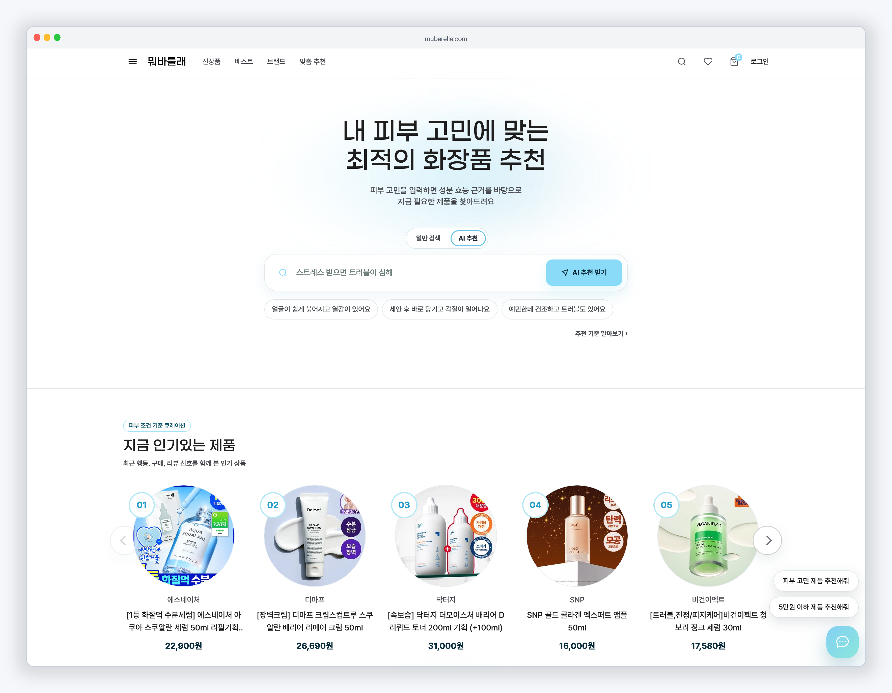
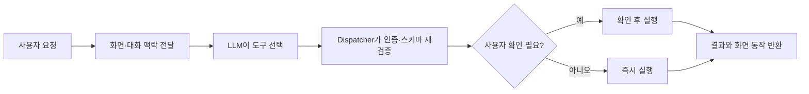

# 뭐바를래

> 피부 고민을 자연어로 이해하고, 성분 근거 기반 추천부터 비교·장바구니·주문 준비까지 연결하는 AI 뷰티 커머스 서비스

[](https://github.com/mwobareullae/jungle_namanmoo/actions/workflows/ci.yml)

[서비스 화면 아카이브](docs/service-screen-archive.md) · [문서 길잡이](docs/README.md) · [Frontend](apps/frontend/README.md) · [Backend](apps/backend/README.md) · [API 계약](docs/api/)

<p align="center">
  
</p>

## 목차

- [프로젝트 소개](#프로젝트-소개)
- [핵심 기능](#핵심-기능)
- [서비스 흐름](#서비스-흐름)
- [시스템 아키텍처](#시스템-아키텍처)
- [핵심 기술 설계](#핵심-기술-설계)
- [성능 최적화](#성능-최적화)
- [Quick Start](#quick-start)
- [API 및 프로젝트 구조](#api-및-프로젝트-구조)
- [기술 스택](#기술-스택)
- [프로젝트 포스터](#프로젝트-포스터)

## 프로젝트 소개

화장품을 고를 때 인기 순위나 광고 문구만으로는 내 피부 고민에 맞는 제품인지 판단하기 어렵습니다. 뭐바를래는 사용자가 자연어로 입력한 피부 고민을 표준 고민과 기대 효능으로 구조화하고, 상품의 성분·근거·함량·피부 적합도·구매 조건을 함께 계산해 추천합니다.

추천 이후에는 AI 쇼핑 에이전트가 현재 화면과 대화 맥락을 바탕으로 상품 검색, 결과 좁히기, 비교, 장바구니, 주문 준비까지 연결합니다. 추천 순위 자체는 LLM이 결정하지 않으며, 재현 가능한 점수 계산 로직이 담당합니다.

### 해결하려는 문제

- 사용자가 성분표와 논문 근거를 직접 해석해야 하는 탐색 비용
- 인기순만으로는 반영하기 어려운 피부 타입·민감도·회피 성분
- 추천 결과를 받은 뒤 다시 검색·비교·구매해야 하는 단절된 흐름

### 제공하는 방식

- 자연어 고민을 표준 고민·효능·검색 및 구매 조건으로 변환
- 검색으로 후보를 찾고 12개 평가축으로 후보 안의 순위를 계산
- 상품 상세에서 핵심 성분, 함량 상태, 근거와 주의 정보를 제공
- 대화로 비교·장바구니·주문 준비 기능을 실행

## 핵심 기능

| 기능 | 사용자에게 제공하는 가치 |
| --- | --- |
| 자연어 피부 고민 이해 | 일상적인 표현을 표준 고민과 필요한 효능으로 구조화합니다. |
| 12축 추천 점수 | 성분·효능·근거·피부 적합도·검색 및 구매 맥락·리뷰 신호를 함께 계산합니다. |
| 추천 근거 확인 | 추천 총점뿐 아니라 성분, 기대 효능, 함량 상태, 근거 출처와 주의 정보를 구분해 보여줍니다. |
| 검색 후보 생성·재매칭 | Elasticsearch로 추천 후보를 생성하고, 사용할 수 없을 때는 DB 인기순 후보로 전환합니다. 생성된 후보 안에서 keyword·pgvector 매칭 점수를 다시 계산합니다. |
| AI 쇼핑 에이전트 | 자연어 요청으로 추천, 결과 좁히기, 비교, 장바구니, 주문 준비를 이어갑니다. |
| 안전한 실행 정책 | 서버가 인증·입력 스키마·화면 동작을 재검증하고, 주문 생성·주문 취소·다중 카테고리 장바구니 구성·대량 찜은 사용자 확인 후 실행합니다. |

## 서비스 흐름

### 추천

<p align="center">
  
</p>

추천 파이프라인은 Elasticsearch로 후보를 먼저 좁히고, 사용할 수 없을 때는 DB 인기순 후보로 전환합니다. 이후 해당 후보 안에서 keyword·pgvector 매칭과 성분, 개인화, 구매 맥락, 리뷰 신호를 결합해 순위를 계산합니다. LLM은 애매한 자연어 구조화와 최종 설명 생성을 보조하지만 점수와 정렬을 직접 생성하지 않습니다.

### AI 쇼핑 에이전트



에이전트에는 17개 typed tool이 등록되어 있습니다. 상품 탐색과 조회는 바로 실행할 수 있고, 다중 상품 장바구니 구성·다중 찜·주문 생성·주문 취소처럼 영향이 큰 작업은 확인 절차를 거칩니다.

## 시스템 아키텍처

<p align="center">
  
</p>

| 영역 | 책임 |
| --- | --- |
| React / Vite | 고객 화면, 추천·검색·커머스 흐름, AI 에이전트 인터페이스 |
| FastAPI | 인증, 피부 프로필, 상품, 추천, 장바구니, 주문·결제, 에이전트 API |
| PostgreSQL / pgvector | 상품·성분·사용자·커머스 데이터와 벡터 검색 데이터 |
| Elasticsearch / nori | 일반 상품 검색과 추천 후보 탐색을 위한 색인 |
| Redis | 추천 후보 캐시, 에이전트 동시성·요청 제한 등 런타임 제어 |
| OpenAI API | 애매한 고민 구조화 보조, 에이전트 도구 선택, 추천 설명 생성 |
| S3 / CloudFront | 상품 이미지 원본 저장과 공개 이미지 전송 |
| GitHub Actions / Docker Compose | CI, 개발 서버 배포와 컨테이너 실행 |

배포 환경별로 활성화되는 구성은 다릅니다. 로컬·개발 서버의 구체적인 실행 조합은 [배포 구성 문서](docs/00-overview/deployment-summary.md)와 루트 `docker-compose.yml`을 기준으로 확인합니다.

## 핵심 기술 설계

### 1. 검색 후보 생성과 추천 순위 계산의 분리

<p align="center">
  
</p>

일반 상품 검색과 추천 검색은 서로 다른 경로입니다. 추천 후보 생성은 Elasticsearch를 우선 사용하고 실패·비활성 시 DB 인기순 fallback을 사용합니다. pgvector는 후보 생성 소스가 아니며, 생성된 후보 안에서 검색 매칭 점수를 다시 계산할 때 임베딩과 입력 조건이 갖춰진 경우에만 사용합니다. 이후 12축 점수와 위험 성분 감점으로 최종 순위를 정합니다.

관련 문서:

- [추천 스코어링 계약](docs/recommendation/backend-scoring-v0.md)
- [후보 생성 설계](docs/recommendation/f180-candidate-generation-plan.md)
- [일반 상품 검색 동작](docs/search/catalog-search-v1-behavior-spec.md)

### 2. 결정론적 12축 추천 스코어링

현재 총점은 다음 12개 축을 가중 결합합니다. 요청 의도와 사용 가능한 개인화 데이터에 따라 실제 적용 가중치는 조정되며, API는 `score_breakdown.adjusted_weights`로 그 결과를 제공합니다.

| 대분류 | 점수축 |
| --- | --- |
| 성분·효능·근거 | `ingredient_effect`, `ingredient_evidence`, `concentration_fit`, `functional_claim` |
| 피부·사용자 개인화 | `skin_profile`, `skin_test_context`, `behavior_personalization` |
| 검색·구매 맥락 | `search_match`, `price`, `market_signal` |
| 리뷰 신뢰 | `review_quality`, `review_profile_affinity` |

회피 성분은 후보 단계에서 제외하고, 민감 위험 성분은 노출 정보와 `risk_penalty` 감점으로 구분합니다. 리뷰나 개인화 데이터가 없을 때는 적용 여부 플래그를 통해 실데이터와 중립값을 구별합니다.

### 3. LLM과 결정론적 로직의 경계

| 구간 | LLM 사용 | 순위 결정 |
| --- | ---: | ---: |
| 자연어 고민 구조화 | 규칙 파서가 모호할 때 보조 | 아니오 |
| 추천 후보·12축 점수·정렬 | 사용하지 않음 | 예 |
| 추천 설명 문구 | 응답에 포함된 사실을 바탕으로 생성 | 아니오 |
| 에이전트 도구 선택 | 화면·대화 맥락을 보고 선택 | 아니오 |
| 실제 도구 실행 | 서버 dispatcher가 검증 후 실행 | 해당 없음 |

### 4. 에이전트 도구 정책과 재검증

에이전트의 선택은 곧바로 시스템 변경으로 이어지지 않습니다. 서버는 도구별로 다음 정책을 다시 확인합니다.

- 로그인 필요 여부
- 읽기·쓰기·파괴적 작업 위험 등급
- 사용자 확인 필요 여부
- 허용할 수 있는 화면 동작
- 반환 가능한 최대 항목 수
- 도구별 제한 시간

비회원은 추천·검색·비교와 비회원 장바구니 기능을 사용할 수 있습니다. 배송지, 주문 내역, 주문 생성·취소처럼 사용자 귀속이나 개인정보가 필요한 기능은 로그인 여부를 서버에서 검증합니다.

관련 문서:

- [액션 에이전트 API 계약](docs/api/action-agent-api-contract.md)
- [에이전트 런타임 API 계약](docs/api/agent-runtime-api-contract.md)
- [에이전트 런타임 제어](docs/operations/agent-runtime-control.md)

### 5. 데이터 수집·정제·적재

```text
원천 상품·성분·리뷰·이미지 데이터
→ 스키마 및 참조 무결성 검증
→ 성분·브랜드 정규화
→ dry-run 검증
→ PostgreSQL upsert 및 집계
→ Elasticsearch 색인 / S3 이미지 저장
```

상품·성분·효능·근거·리뷰·이미지는 파일별 계약과 검수 규칙을 거쳐 적재합니다. 서비스 DB에는 이미지의 공개 URL을 직접 저장하지 않고 `storage_key`를 유지하며, 프론트가 CloudFront 기준 URL을 조합합니다.

상세한 필드와 적재 규칙은 README에 중복하지 않고 아래 문서를 정본으로 사용합니다.

- [데이터 계약](docs/data/data-contract.md)
- [데이터 디렉터리 안내](data/README.md)
- [성분 seed 가이드](docs/data/ingredient-seed-guide.md)
- [리뷰 적재 운영](docs/operations/review-import-operations.md)

## 성능 최적화

79,952개 상품에서 저장 피부 프로필, 스킨 테스트, 행동 이력과 리뷰 신호를 함께 계산하는 개인화 추천 요청을 단계별로 계측했습니다. 최종 결과만 캐시하기보다 병목 구간을 분리하고, 후보 탐색과 점수 입력 데이터 조회 구조를 순서대로 변경했습니다.

### 측정 조건

- 데이터: 실제 상품 `79,952개`
- 시나리오: `full-personalized`
- 부하: `VUS 10`, `3분`
- 캐시: `cold`
- 주요 지표: End-to-end p95, Scoring p95, 처리량, 오류율
- 오류 gate: `1% 이하`

<p align="center">
  
</p>

### 병목과 개선 단계

| 단계 | 확인한 병목 | 적용한 변경 | End-to-end p95 | 오류율 |
| --- | --- | --- | ---: | ---: |
| Baseline | 후보 추출 전 브랜드 alias 전수 매칭과 온라인 점수 입력 계산 | 문제 재현 및 단계별 계측 추가 | 52.01초 | 2.00% |
| Opt1 | Python 파서와 Elasticsearch에 중복된 검색 책임 | 브랜드 전수 매칭 제거, ES 중심 후보 추출 | 12.80초 | 0.00% |
| Opt2 | 변하지 않는 상품 특징과 사용자 선호를 요청마다 반복 계산 | feature·preference rollup/read model 사전 계산 | 7.77초 | 0.00% |
| Opt3 | 후보 점수 데이터를 여러 쿼리와 Python 조립으로 조회 | 후보 ID 기준 단일 bulk JOIN prefetch | 7.38초 | 0.00% |

Baseline은 오류 gate를 초과했기 때문에 문제 재현 자료로만 사용하며, `52.01초 → 7.38초`를 확정 개선율로 계산하지 않습니다. 같은 성공 조건끼리 비교하면 Opt1→Opt2에서 End-to-end p95가 `39.3%`, Scoring p95가 `51.8%` 개선됐고, Opt2→Opt3에서는 각각 `5.0%`, `14.1%` 개선됐습니다.

현재 README 수치는 비교 조건과 원본 run이 연결된 Baseline~Opt3 생성 리포트를 기준으로 합니다. 후속 단계는 같은 조건과 provenance가 확인된 뒤 이 표에 추가합니다.

### VUS 100 확장성 실험

단일 요청의 병목 개선과 별도로, 배포 환경에서 `100 VUS`가 추천 API를 10분간 반복 호출하는 부하 테스트를 수행했습니다. 이 결과는 위의 `VUS 10·3분·cold cache` 최적화 단계와 조건이 다르므로 같은 개선 추이에 합산하지 않습니다.

| 구성 | 실행 시간 | 추천 API p95 | 처리량 | 오류율 | 요청 수 | p95 3초 SLA |
| --- | ---: | ---: | ---: | ---: | ---: | --- |
| ASG 자동 확장 | 10분 | 15.35초 | 18.17 RPS | 0.0363% | 11,011 | 실패 |
| ASG 5대 고정 | 10분 | 4.81초 | 30.86 RPS | 0.0054% | 18,568 | 실패 |

5대를 미리 실행한 구성은 자동 확장 run보다 더 높은 처리량과 낮은 p95를 기록했지만, 두 구성 모두 목표인 p95 3초를 충족하지 못했습니다. 따라서 이 결과는 “오토스케일링으로 성능 문제가 해결됐다”는 근거가 아니라, 급격한 부하에서는 사전 용량 확보와 애플리케이션 병목 개선이 함께 필요하다는 실험 결과로 사용합니다.

> 원본 k6 출력은 로컬 `perf-runs/asg-scaling-20260722-211212`와 `perf-runs/asg-fixed5-20260722-214757`에서 확인했습니다. 발표 비교표의 단일 서버 `p95 6.448초` 행은 현재 저장소에서 대응 raw run과 실행 manifest를 찾지 못해 위 확정 표에는 포함하지 않았습니다.

관련 문서:

- [추천 성능 최적화 Case Study](docs/performance/recommendation-performance-case-study.md)
- [추천 성능 측정 결과](docs/performance/results/recommendation/README.md)
- [성능 테스트 실행·재생성 방법](docs/performance/README.md)

## Quick Start

### 요구 환경

- Docker
- Docker Compose
- Git
- AI 에이전트와 LLM 보조 기능 사용 시 OpenAI API key

### 1. 저장소와 환경변수 준비

```bash
git clone https://github.com/mwobareullae/jungle_namanmoo.git
cd jungle_namanmoo
cp .env.example .env
```

`.env`에는 실제 secret을 커밋하지 않습니다. 브라우저에 노출되는 `VITE_*` 변수에도 secret을 넣지 않습니다.

### 2. 전체 로컬 개발 구성 실행

```bash
docker compose \
  --profile backend-dev \
  --profile frontend-local-backend \
  config

docker compose \
  --profile backend-dev \
  --profile frontend-local-backend \
  up -d --build
```

### 3. DB migration

```bash
docker compose exec backend python -m alembic upgrade head
```

가벼운 예제 데이터가 필요할 때:

```bash
docker compose exec backend \
  python -m app.cli.seed_data --data-dir /data/examples
```

전체 데이터 적재와 검색 색인은 실행 시간과 환경 의존성이 크므로 [Backend 실행 문서](apps/backend/README.md), [데이터 안내](data/README.md), [검색 문서](docs/search/)를 확인합니다.

### 4. 접속 확인

| 대상 | 주소 |
| --- | --- |
| Frontend | <http://localhost:5173> |
| Backend | <http://localhost:8000> |
| Health check | <http://localhost:8000/api/health> |
| Swagger UI | <http://localhost:8000/docs> |
| OpenAPI JSON | <http://localhost:8000/openapi.json> |
| Elasticsearch | <http://127.0.0.1:9200> |

```bash
curl http://localhost:8000/api/health
```

종료:

```bash
docker compose down
```

## API 및 프로젝트 구조

### API 확인 방법

README에는 주요 API 영역과 문서 위치만 제공합니다. 실행 중인 API의 전체 endpoint와 스키마는 Swagger UI에서 확인하고, 프론트·백엔드 간 세부 계약은 `docs/api/` 문서를 기준으로 확인합니다.

| API 영역 | 주요 기능 | 상세 문서 |
| --- | --- | --- |
| Auth / Skin | 인증 세션, 피부 프로필·피부 테스트 | [인증 쿠키](docs/api/auth-session-cookie.md) |
| Home / Search | 홈 섹션, 일반 상품 검색·자동완성 | [홈](docs/api/home-sections-api-contract.md), [검색](docs/api/catalog-search-api-contract.md) |
| Recommendation / Product | 맞춤 추천 생성·조회, 상품 상세 | [스코어링](docs/recommendation/backend-scoring-v0.md), [상품 상세](docs/api/product-detail-purchase-info-api.md) |
| Cart / Order / Payment | 비회원·회원 장바구니, checkout, 주문·결제 | [장바구니](docs/api/cart-checkout-api-contract.md), [주문·결제](docs/api/order-payment-api-contract.md) |
| Agent | 도구 선택, 실행 결과, confirmation | [액션 에이전트](docs/api/action-agent-api-contract.md), [런타임](docs/api/agent-runtime-api-contract.md) |
| Review / Activity | 리뷰, 찜, 최근 본 상품 | [리뷰](docs/api/review-api-contract.md), [사용자 활동](docs/api/wishlist-recent-api-contract.md) |

### 프로젝트 구조

```text
jungle_namanmoo/
├── apps/
│   ├── frontend/          # React·Vite 고객 화면
│   └── backend/           # FastAPI API와 도메인 서비스
├── data/                  # 상품·성분·근거·리뷰 데이터와 적재 입력
├── docker/                # Elasticsearch 등 커스텀 이미지
├── docs/                  # API·데이터·추천·검색·운영 문서
├── scripts/               # 운영·검증 스크립트
├── tests/                 # 통합·부하 테스트 자산
├── docker-compose.yml     # 로컬·개발 실행 기준
└── .env.example           # 환경변수 계약
```

세부 문서는 [문서 길잡이](docs/README.md), 프론트와 백엔드의 개별 명령은 각각의 README에서 확인합니다.

## 기술 스택

| 영역 | 기술 |
| --- | --- |
| Frontend | React 18, TypeScript, Vite, React Router, TanStack Query, Tailwind CSS |
| Backend | Python 3.12, FastAPI, Pydantic, SQLAlchemy, Alembic |
| Database | PostgreSQL 16, pgvector |
| Search / Cache | Elasticsearch 8.15, nori, Redis 7.2 |
| AI | OpenAI API, OpenAI Agents SDK, `text-embedding-3-small` |
| Commerce | Toss Payments SDK, Confirm API, Webhook |
| Storage / Delivery | AWS S3, CloudFront |
| Infra / DevOps | AWS EC2·RDS, Docker Compose, GitHub Actions, Vercel, CloudWatch |

## 프로젝트 포스터

<p align="center">
  
</p>
