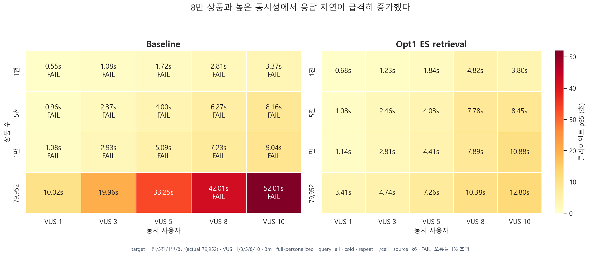
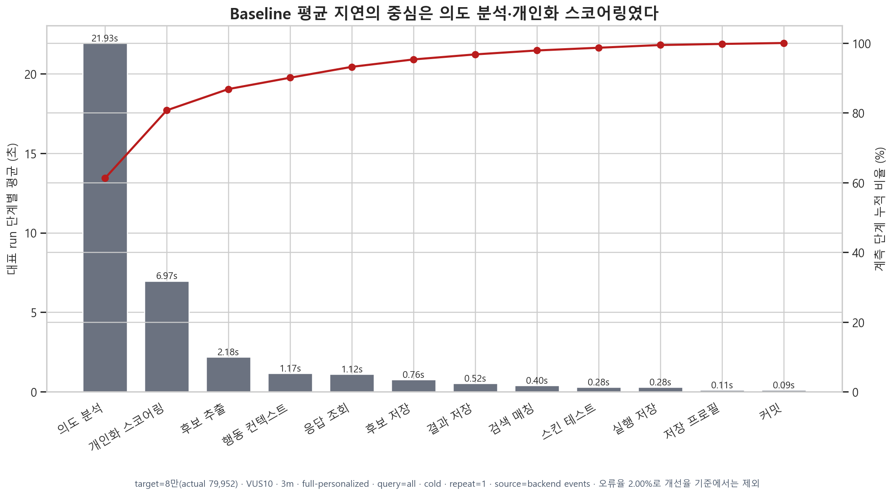
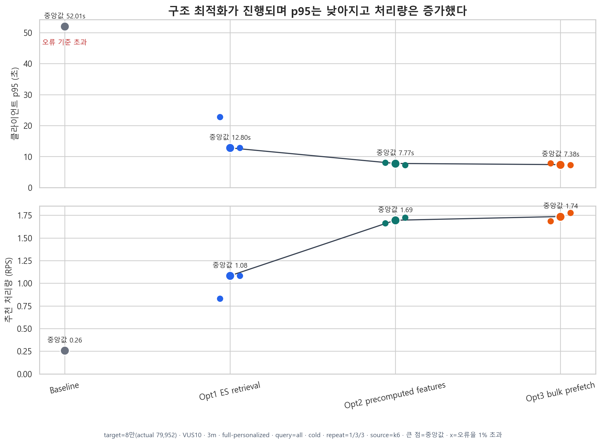
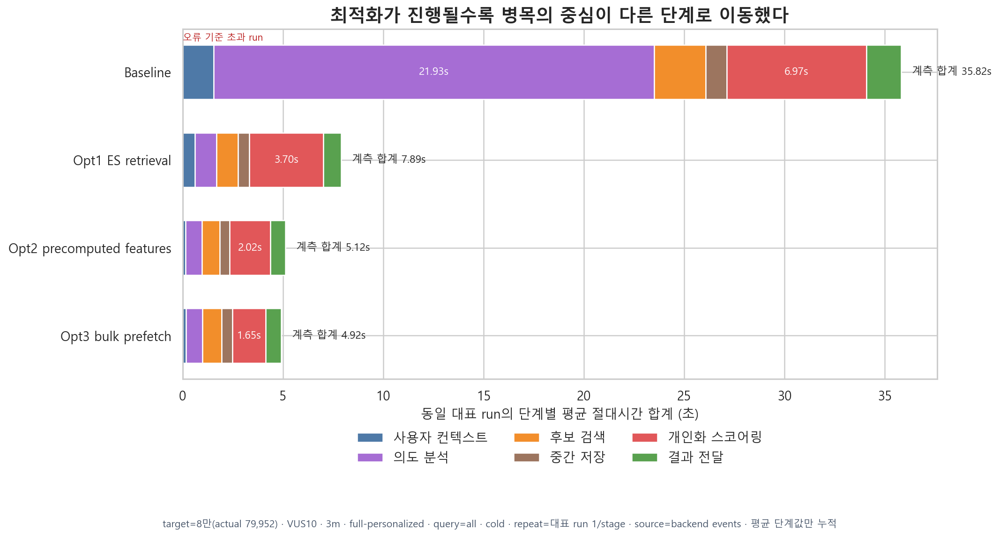
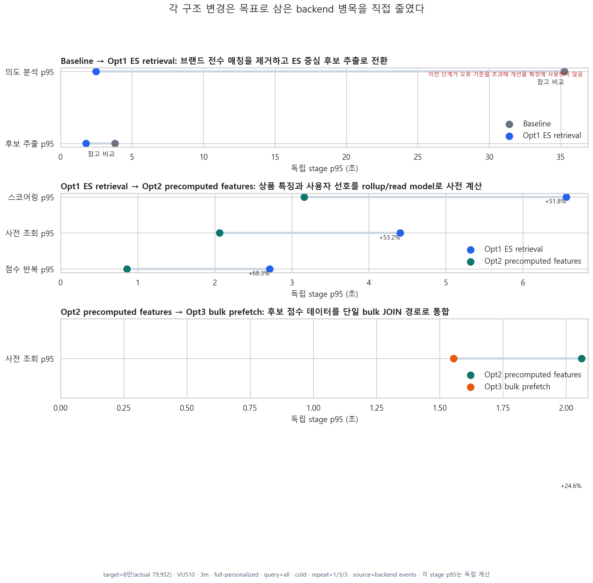
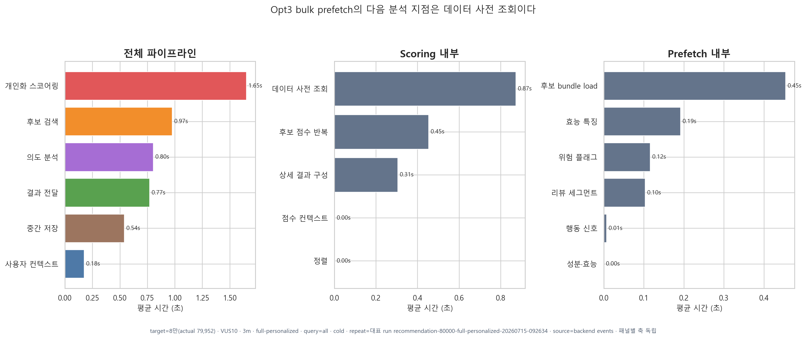
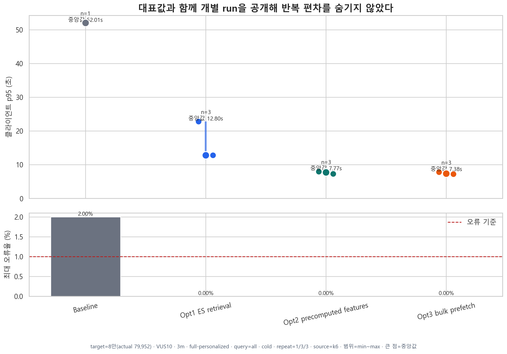

<!-- Generated by scripts/perf/generate_recommendation_performance_report.py. -->
# 8만 상품 개인화 추천 파이프라인 성능 최적화

79,952개 상품을 대상으로 저장 프로필, 스킨 테스트, 행동, 리뷰를 함께 계산하는 추천 요청을 계측하고 병목을 구조적으로 제거한 기록이다.

## 한눈에 보는 결과

아래 값은 `Opt2 precomputed features → Opt3 bulk prefetch`의 동일 조건 반복 run 중앙값이다.

| 지표 | 이전 | 이후 | 변화 |
|---|---:|---:|---:|
| End-to-end p95 | 7.77초 | 7.38초 | +5.0% |
| 처리량 | 1.69 RPS | 1.74 RPS | +2.4% |
| Scoring p95 | 3.16초 | 2.72초 | +14.1% |
| 오류율 | 0.00% | 0.00% | 유지 |

> Baseline 8만/VUS10 실행은 오류율 기준을 초과했다. 성능 붕괴를 보여주는 문제 재현 자료로만 사용하며 확정 개선율 계산에서는 제외한다.

## 문제와 측정 기준

상품 수와 동시 사용자를 함께 늘렸을 때 어느 구간에서 추천이 무너지는지 확인하고, client p95와 backend 단계 계측을 분리해 병목을 찾았다.

- 기준: `79,952`개 상품, `full-personalized`, VUS `10`, `3m`, `cold` cache
- 오류 gate: `1%` 이하
- client latency: k6 recommendation trend
- backend latency: `recommendation_pipeline_completed` 단계 계측
- 상세 환경: [벤치마크 환경](./benchmark-environment.md), [실행 방법](./benchmark-run.md)



## Baseline에서 확인한 최초 병목

Baseline 8만/VUS10의 오류율은 `2.00%`였다. 아래 Pareto는 성공 요청의 평균 단계 시간으로 병목 위치를 설명하며, 실패 요청을 숨긴 성공 지표로 사용하지 않는다.



## 최적화 타임라인

구현 단계는 발견된 병목 이름이 아니라 해당 run에서 적용된 코드 변경을 뜻한다. 병목은 매 단계의 전체 계측값에서 다시 발견한다.





## 단계별 기술 선택과 직접 효과

### Opt1 ES retrieval

브랜드 전수 매칭을 제거하고 ES 중심 후보 추출로 전환. 후보 품질이 Elasticsearch 색인과 field boost 설정에 더 의존한다. 대신 Python은 점수 계산에 필요한 고민·효능 구조화에 집중한다. 설계 근거는 [Opt1 ES retrieval 상세 설계](./recommendation-es-retrieval-optimization.md), 측정 근거는 [Opt1 ES retrieval 결과](./results/recommendation/details/opt1-es-retrieval/README.md)에 정리했다.

### Opt2 precomputed features

상품 특징과 사용자 선호를 rollup/read model로 사전 계산. rollup 최신성 관리와 배치 운영이 필요하다. 누락·구버전 행은 기존 온라인 계산으로 fallback해 정확성을 보존한다. 설계 근거는 [Opt2 precomputed features 상세 설계](./recommendation-feature-rollup.md), 측정 근거는 [Opt2 precomputed features 결과](./results/recommendation/details/opt2-precomputed-features/README.md)에 정리했다.

### Opt3 bulk prefetch

후보 점수 데이터를 단일 bulk JOIN 경로로 통합. bulk JOIN은 왕복 횟수를 줄이지만 행 폭과 중복 전송량이 커질 수 있어 batch 크기와 메모리를 함께 관찰해야 한다. 설계 근거는 [Opt3 bulk prefetch 상세 설계](./recommendation-bulk-prefetch.md), 측정 근거는 [Opt3 bulk prefetch 결과](./results/recommendation/details/opt3-bulk-prefetch/README.md)에 정리했다.



## 현재 병목과 다음 최적화

최신 단계에서도 전체 시간이 사라진 것은 아니다. 아래 확대 그래프는 동일 대표 run의 평균값을 사용해 다음 조사 대상을 보여준다.



다음 구현 단계인 bulk prefetch는 후보 점수 데이터의 순차 조회를 통합하는 작업이다. 아직 registry에 검증된 측정 run이 없으므로 결과를 0이나 예상치로 그리지 않는다. 설계는 [Opt3 bulk prefetch](./recommendation-bulk-prefetch.md)에 기록한다.

## 반복 안정성과 한계



자원 사용량과 run 수집 범위는 메인 결론과 분리해 [resource guardrail](./results/recommendation/appendix/resource-guardrails.png), [run coverage](./results/recommendation/appendix/run-coverage.png)에서 확인한다.

- Baseline target run은 오류 gate를 넘었으므로 문제 재현 전용이다.
- Opt2는 8만/VUS10 반복 측정만 있어 상품 수×VUS 전체 matrix 비교에는 포함하지 않았다.
- 수집 manifest의 `git_sha`가 `unknown`이라 구현 단계 배치는 registry와 측정 문서 근거로 관리한다.
- 최상위 loose run은 구현 단계가 증명될 때까지 `unassigned`로 남긴다.
- CPU와 메모리는 인과 지표가 아니라 과부하 여부를 확인하는 guardrail로만 사용한다.

## 재현

```powershell
python scripts/perf/generate_recommendation_performance_report.py
```

새 최적화 단계는 `scripts/perf/recommendation-performance-report.json`에 구현 변경, 비교 대상, 입력 run 경로와 상세 문서를 등록한 뒤 같은 명령을 다시 실행한다. 계측만 바뀐 run은 새 단계로 만들지 않고 로그 필드에 따라 `measurement_schema`만 자동 분류한다.

입력 run, 제외 사유, 대표 run과 원본 해시는 [provenance.json](./results/recommendation/data/provenance.json), [comparability.csv](./results/recommendation/data/comparability.csv)에서 확인할 수 있다.
