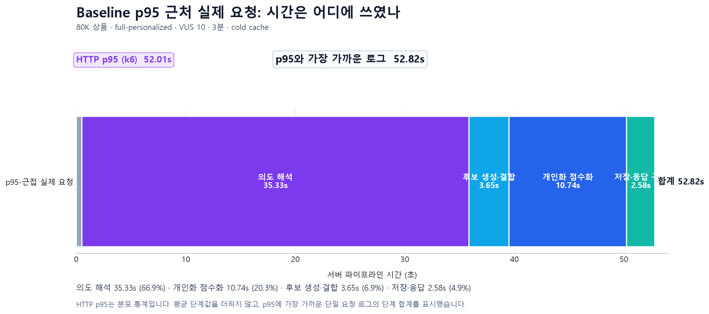
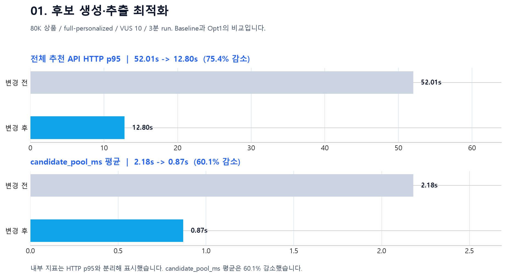

# 01. 후보 생성·추출 최적화

후보 경로는 **Opt1 ES 전환 → Opt6 후보 소스 단순화 → Opt10 Redis warm cache** 순서로 개선했다.

| 이정표 | 핵심 변화 | 추천 API HTTP p95 |
| --- | --- | ---: |
| Baseline | Python 조건 파서와 다중 후보 소스 병합 | 52.01초 |
| **Opt1** | 텍스트 후보 매칭을 Elasticsearch 중심으로 전환 | **12.80초** |
| Opt6 | 정상 경로를 Elasticsearch 단일 후보 소스로 정리 | 6.48초 |
| Opt10 | 동일 조건 후보를 Redis warm cache에서 재사용 | 4.00초 |

> 공통 조건: 80K 상품 · full-personalized · VUS 10 · 3분 run. HTTP p95는 분포 통계이므로 내부 단계 평균과 합산하지 않는다.

## Opt1. Elasticsearch 중심 후보 추출

`52.01초`는 k6가 계산한 HTTP p95다. 위 그래프는 그 값에 가장 가까운 실제 서버 요청(`52.82초`) 한 건의 단계 로그를 사용하므로, 막대 구간의 합계가 실제 요청 시간과 일치한다. 이 요청에서도 의도 해석이 `35.33초(66.9%)`, 점수화가 `10.74초(20.3%)`로 대부분을 차지했다.

### 진단

- Baseline에서 `intent_parse_ms` 평균이 **21.93초**로 가장 컸다.
- p95-근접 실제 요청에서도 `intent_parse_ms`는 **35.33초**로 가장 큰 구간이었다.
- 구매 조건 파서가 브랜드 alias 약 **2,657개**를 요청마다 정규식으로 전수 검사했다.
- 브랜드가 언급되지 않은 문장도 전체 목록을 순회해, 상품 수가 커질수록 후보 생성 이전 비용이 커졌다.

### 판단

문서 텍스트에서 관련 후보를 찾는 일은 역색인 검색엔진의 책임으로 옮기고, 추천 규칙만 Python에 남겼다.

| Elasticsearch가 담당 | Python이 계속 담당 |
| --- | --- |
| 브랜드/상품명/카테고리/키워드 후보 검색과 field boost | 고민·효능·가격·회피 성분 등 구조화 조건 생성 |
| 빠른 관련도 기반 후보 회수 | 가격 범위와 명시적 회피 성분 같은 정확 필터 |

### 검증 결과

| 지표 | Baseline | Opt1 | 변화 |
| --- | ---: | ---: | ---: |
| 전체 추천 API HTTP p95 | 52.01초 | 12.80초 | **-39.21초, -75.4%** |
| `intent_parse_ms` 평균 | 21.93초 | 1.04초 | **-95.3%** |
| `candidate_pool_ms` 평균 | 2.18초 | 0.87초 | **-60.1%** |

Opt1은 파서를 삭제한 것이 아니라, **전수 텍스트 매칭만 Elasticsearch 역색인 후보 검색으로 분리**한 변경이다. 그래서 가격·회피 성분처럼 정확성이 필요한 조건은 유지하면서 병목을 제거했다.

---

## 이어진 개선

- [Opt6 후보 소스 단순화](../recommendation-candidate-pool-v2.md): ES 성공 시 pgvector/legacy DB 후보 병합과 500개 DB hydration을 건너뛰었다.
- [Opt10 Redis 후보 캐시](../recommendation-candidate-cache.md): 동일 조건의 후보를 300초 동안 재사용해 warm 경로를 줄였다.

## 원본 근거

- [단계별 구성 요소 계측값](../results/recommendation/transitions/data/pipeline-component-metrics.csv)
- [Baseline 대비 Opt1 구성 요소 변화](../results/recommendation/transitions/data/pipeline-component-deltas.csv)
- [Opt1 ES retrieval 설계 문서](../recommendation-es-retrieval-optimization.md)
