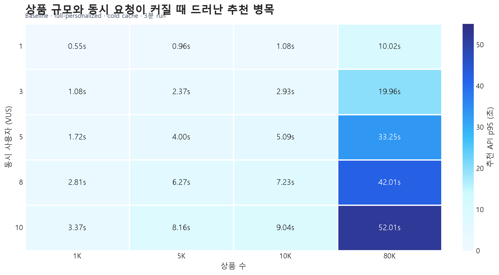
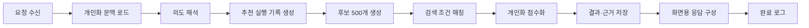
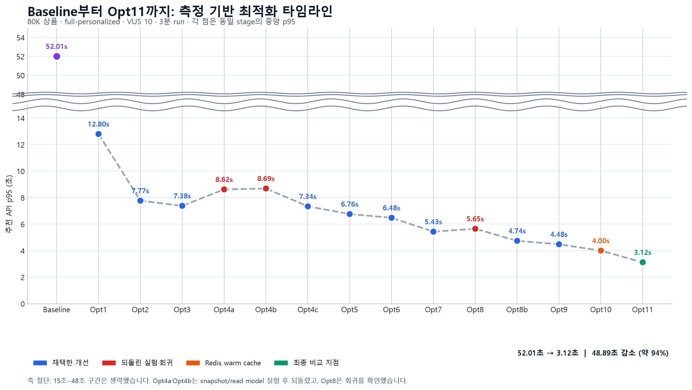
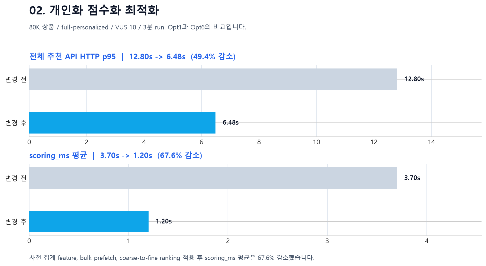
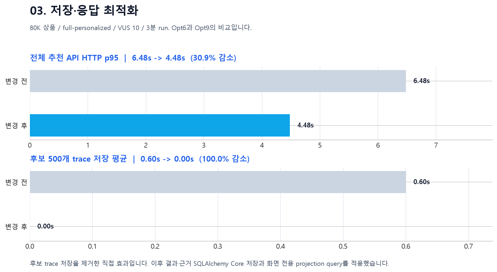
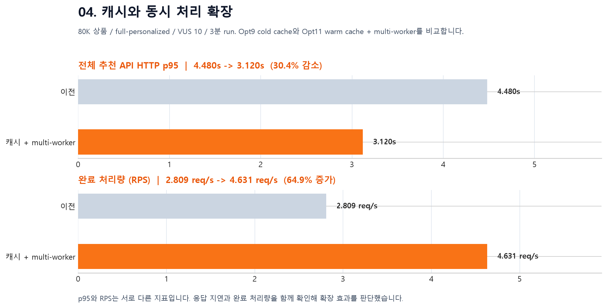

# 8만 상품 개인화 추천 성능 최적화

이 문서는 1K 상품에서는 드러나지 않던 추천 병목이 80K 상품에서 어떻게 나타났고, 어떤 계측과 기술적 판단으로 줄였는지 정리한다.

## 한눈에 보기

- 조건: 실제 상품 약 79,952개, `full-personalized`, VUS 10, 3분 run
- Baseline: HTTP p95 `52.01초`, 오류율 `2.00%`
- 최종 비교 지점: HTTP p95 `3.12초`, 오류율 `0.00%`, 완료 처리량 `4.631 RPS`
- 결과: p95 `48.89초` 감소, 약 `94.0%` 개선



1K에서는 VUS 10의 p95가 3.37초였지만, 같은 조건의 80K에서는 52.01초로 증가했다. 따라서 작은 데이터셋의 정상 동작만으로는 실제 규모에서의 후보 추출·점수화·저장 비용을 판단할 수 없었다.

## 추천 요청 실행 흐름과 계측 지점

아래는 추천 API 요청 한 건이 실제로 통과하는 순서다. 이후의 네 가지 최적화 구간은 이 흐름을 대체하는 분류가 아니라, **이 실행 흐름의 병목을 묶어 개선한 결과**다.



| 순서 | 실제 처리 | 대표 계측 키 | 하는 일 |
|---:|---|---|---|
| 1 | 사용자 개인화 문맥 로드 | `user_context_load_ms` | 로그인 사용자의 저장 피부 프로필을 읽는다. |
| 2 | 피부 테스트 문맥 로드 | `skin_test_context_load_ms` | 피부 테스트 결과를 점수화 입력으로 준비한다. |
| 3 | 행동 문맥 로드 | `behavior_context_load_ms` | 클릭·찜·구매 등 행동 개인화 신호를 준비한다. |
| 4 | 의도 해석 | `intent_parse_ms` | 자연어 고민을 concern·효능·가격·카테고리·성분 조건으로 구조화한다. |
| 5 | 추천 실행 기록 생성 | `run_save_ms` | 요청 조건과 실행 단위를 저장한다. |
| 6 | 후보 500개 생성 | `candidate_pool_ms` | Elasticsearch와 후보 cache를 사용해 점수화 대상 후보를 만든다. |
| 7 | 검색 조건 매칭 | `search_match_ms` | 필수 성분·검색 조건을 후보에 적용하고 매칭 결과를 만든다. |
| 8 | 후보 추적 저장 (Opt7 이전) | `search_candidate_save_ms` | 후보 500개와 추출 경로를 저장하던 과거 단계다. Opt7에서 제거했다. |
| 9 | 개인화 점수화 | `scoring_ms` | 후보를 빠르게 1차 평가하고 상위 50개를 상세 평가한다. |
| 10 | 결과·근거 저장 | `result_save_ms` | 최종 상품, 점수, 성분 근거를 저장한다. |
| 11 | 트랜잭션 확정 | `commit_ms` | 저장된 추천 실행을 커밋한다. |
| 12 | 화면용 응답 구성 | `response_load_ms` | 화면에 필요한 상위 상품과 근거를 projection 조회·직렬화한다. |
| 13 | 완료 로그 | `recommendation_pipeline_completed` | 전체 시간, 세부 계측, cache hit, LLM 사용 여부를 남긴다. |

### 네 가지 최적화 구간으로 묶은 단계

| 최적화 구간 | 실행 흐름에서 해당하는 단계 | 이 구간에서 다룬 병목 |
|---|---|---|
| 후보 생성·추출 | 4 의도 해석, 6 후보 생성, 7 검색 조건 매칭 | 자연어 조건을 후보 검색으로 연결하는 비용과 후보 pool 생성 비용 |
| 개인화 점수화 | 1~3 개인화 문맥 로드, 9 개인화 점수화 | 500개 후보의 개인화 입력 준비와 점수 계산 비용 |
| 저장·응답 | 5 실행 기록, 8 후보 추적 저장(Opt7 이전), 10~12 결과 저장·커밋·응답 구성 | 불필요한 중간 저장, 결과·근거 저장, 화면용 재조회 비용 |
| 캐시·동시 처리 | 6 후보 생성의 cache 경로, 전체 요청 처리 경로 | 반복 후보 추출과 단일 worker 처리 한계 |

각 구간 안의 더 세부적인 계측 키와 원인 분석은 아래 단계별 문서에서 다룬다.

## 전체 최적화 타임라인



`Opt4a`, `Opt4b`는 snapshot/read model 접근이 실제로 느려져 되돌린 실험이며, `Opt8`은 저장 bulk insert만으로는 개선되지 않은 회귀 지점이다. 성공한 변경만 남기지 않고, 계측 후 가설을 폐기한 과정도 함께 남겼다.

## 4개 구간 요약

### [01. 후보 생성·추출](01-candidate-retrieval.md)

- **문제:** 80K에서 후보 생성과 브랜드 매칭 비용이 요청 경로를 지배했다.
- **변경:** Elasticsearch 중심 retrieval로 전환하고 중복 브랜드 매칭을 제거했다.
- **결과:** 전체 HTTP p95 `52.01초 → 12.80초`, `candidate_pool_ms` 평균 `2.18초 → 0.87초` (`60.1%` 감소).


- [후보 생성·추출 세부 계측과 기술 판단 보기](01-candidate-retrieval.md)

### [02. 개인화 점수화](02-personalized-scoring.md)

- **문제:** 후보 500개를 모두 동일한 상세 경로로 평가해 prefetch와 score loop가 누적됐다.
- **변경:** 사전 집계 feature, bulk prefetch, coarse-to-fine ranking을 적용했다.
- **결과:** 전체 HTTP p95 `12.80초 → 6.48초`, `scoring_ms` 평균 `3.70초 → 1.20초` (`67.6%` 감소), 상세 평가는 `500개 → 50개`.



- [개인화 점수화 세부 계측과 기술 판단 보기](02-personalized-scoring.md)

### [03. 저장·응답](03-persistence-response.md)

- **문제:** 화면에 쓰지 않는 후보 500개 trace와 ORM 중심 저장·재조회가 요청 말미 비용을 만들었다.
- **변경:** 후보 trace 저장을 제거하고, 결과·근거는 SQLAlchemy Core bulk write, 응답은 화면 전용 projection query로 전환했다.
- **결과:** 전체 HTTP p95 `6.48초 → 4.48초`; 후보 trace 저장 평균 `0.60초 → 0초`.



- [저장·응답 세부 계측과 기술 판단 보기](03-persistence-response.md)

### [04. 캐시·동시 처리](04-cache-concurrency.md)

- **문제:** 동일 후보 추출의 반복 비용과 단일 프로세스의 동시 처리 한계가 남아 있었다.
- **변경:** Redis 후보 cache와 Uvicorn multi-worker를 적용했다.
- **결과:** 전체 HTTP p95 `4.48초 → 3.12초` (`30.4%` 감소), 완료 처리량 `2.809 → 4.631 RPS` (`64.9%` 증가), 오류율 `0.00%`.



- [캐시·동시 처리 세부 계측과 기술 판단 보기](04-cache-concurrency.md)

## 읽는 방법

각 단계 문서의 그래프는 두 층으로 구성된다.

1. 위: 사용자가 체감하는 전체 추천 API HTTP p95
2. 아래: 해당 단계가 직접 겨냥한 내부 지표

내부 평균 시간과 HTTP p95는 다른 통계량이므로 합산하지 않는다. 대신 같은 지표의 전후 값만 비교해 기술 선택의 직접 효과를 확인한다.

## 원본과 재현

- 전체 run·분석 그래프: [결과 인덱스](../results/recommendation/README.md)
- 성능 테스트 실행과 재생성: [성능 테스트 문서](../README.md)
- README와 이 문서의 그림 재생성:

```powershell
python scripts/perf/generate_readme_performance_graphs.py
python scripts/perf/generate_recommendation_phase_graphs.py
```

> Baseline은 cold cache, 최종 비교는 Redis warm cache와 multi-worker를 포함한다. 최종 수치는 단일 코드 변경만의 효과가 아니라 추천 경로와 런타임 확장을 함께 적용한 결과다.
