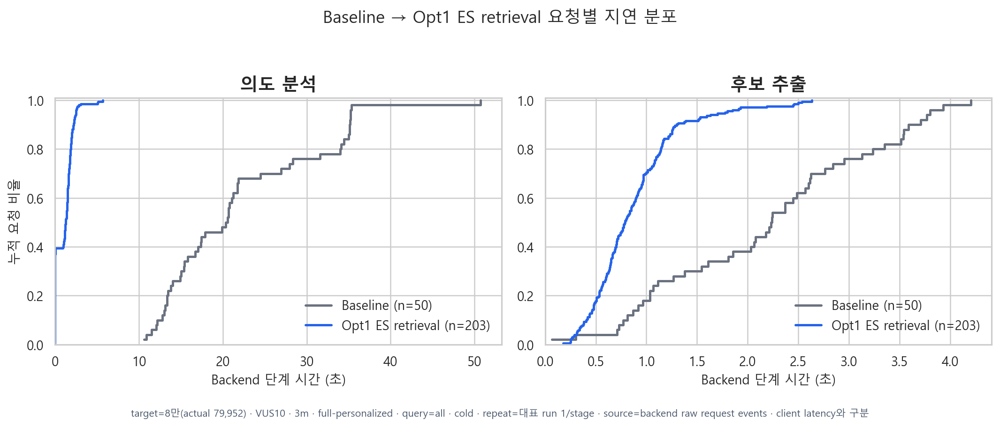
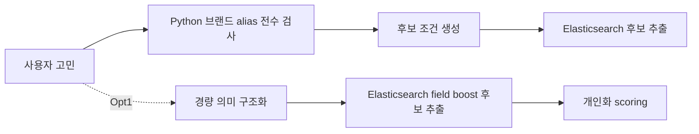

<!-- Generated by scripts/perf/generate_recommendation_performance_report.py. -->
# Opt1 ES retrieval 측정 결과

## 관측과 선택

- 적용 변경: 브랜드 전수 매칭을 제거하고 ES 중심 후보 추출로 전환
- 비교 대상: Baseline
- 조건: 79,952개 / full-personalized / VUS10 / 3분 / cold cache
- 상세 설계: [문서 보기](../../../../recommendation-es-retrieval-optimization.md)

## 관측

의도 분석 안의 구매 조건 파서가 일반 고민 문장에도 브랜드 alias 전체를 검사했다.

## 원인

약 2,657개 alias 정규식 전수 검사가 후보 추출 전에 매 요청 반복됐고, 검색 책임이 Python 파서와 Elasticsearch에 중복 배치돼 있었다.

## 검토한 대안

정규식 캐시나 Aho-Corasick으로 전수 매칭 자체를 빠르게 만드는 대안도 검토했지만, 검색 책임 중복을 유지한다는 한계가 있었다.

## 기술 선택과 트레이드오프

후보 품질이 Elasticsearch 색인과 field boost 설정에 더 의존한다. 대신 Python은 점수 계산에 필요한 고민·효능 구조화에 집중한다.

## 구현 구조

브랜드·카테고리·상품명 탐색을 ES retrieval로 이동하고, Python hard filter 생성 경로를 축소했다.

## 동일 조건 결과

| 지표 | 이전 | 이후 | 변화 |
|---|---:|---:|---:|
| End-to-end p95 | 52.01초 | 12.80초 | 참고 비교 |
| 처리량 | 0.26 RPS | 1.08 RPS | 참고 비교 |
| Scoring p95 | 14.11초 | 6.56초 | 참고 비교 |
| 오류율 | 2.00% | 0.00% | 참고 비교 |

> 이전 단계가 오류 gate를 초과해 확정 개선율로 사용하지 않는다.

## 요청별 분포

## 효과와 새로 드러난 병목

후보 추출 이후 개인화 scoring이 전체 backend 시간의 중심으로 이동했다.

## 해석 범위

- ECDF는 backend 완료 이벤트의 요청별 표본이며 client end-to-end 분포가 아니다.
- 단계 p95는 각각 독립적으로 계산하며 합산하지 않는다.
- 대표 수치는 반복 run 중앙값이고 개별 값은 메인 안정성 그래프와 normalized CSV에 남긴다.
