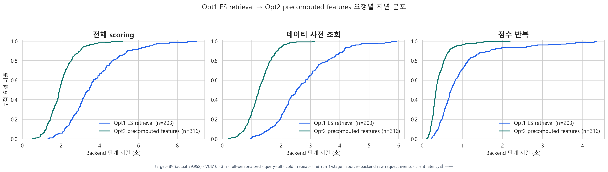
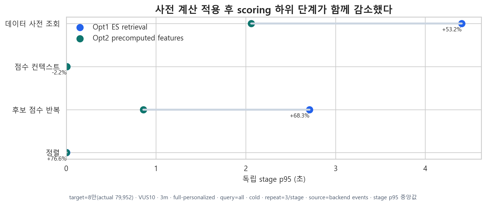
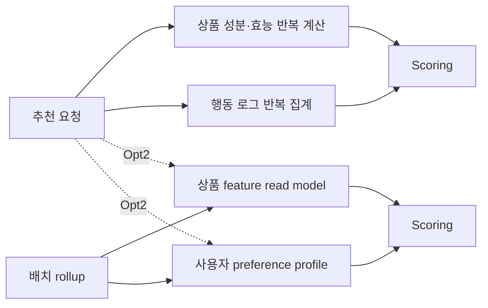

<!-- Generated by scripts/perf/generate_recommendation_performance_report.py. -->
# Opt2 precomputed features 측정 결과

## 관측과 선택

- 적용 변경: 상품 특징과 사용자 선호를 rollup/read model로 사전 계산
- 비교 대상: Opt1 ES retrieval
- 조건: 79,952개 / full-personalized / VUS10 / 3분 / cold cache
- 상세 설계: [문서 보기](../../../../recommendation-feature-rollup.md)

## 관측

후보마다 성분·효능 특징을 만들고 사용자 행동 로그를 다시 집계하는 작업이 scoring에서 반복됐다.

## 원인

요청 시점에 변하지 않는 상품 특징과 느리게 변하는 사용자 선호까지 온라인 경로에서 매번 계산했다.

## 검토한 대안

최종 추천 결과 캐시와 Redis 캐시도 검토할 수 있지만 검색어·피부 프로필 조합별 폭증과 무효화 복잡도가 크다.

## 기술 선택과 트레이드오프

rollup 최신성 관리와 배치 운영이 필요하다. 누락·구버전 행은 기존 온라인 계산으로 fallback해 정확성을 보존한다.

## 구현 구조

상품 feature read model과 사용자 preference profile을 미리 계산하고 요청에서는 유효한 버전을 조회한다.

## 동일 조건 결과

| 지표 | 이전 | 이후 | 변화 |
|---|---:|---:|---:|
| End-to-end p95 | 12.80초 | 7.77초 | +39.3% |
| 처리량 | 1.08 RPS | 1.69 RPS | +56.7% |
| Scoring p95 | 6.56초 | 3.16초 | +51.8% |
| 오류율 | 0.00% | 0.00% | 유지 |

## 요청별 분포

## 효과와 새로 드러난 병목

계산량은 줄었지만 후보 점수 데이터의 여러 loader와 score loop가 다음 병목으로 남았다.

## 해석 범위

- ECDF는 backend 완료 이벤트의 요청별 표본이며 client end-to-end 분포가 아니다.
- 단계 p95는 각각 독립적으로 계산하며 합산하지 않는다.
- 대표 수치는 반복 run 중앙값이고 개별 값은 메인 안정성 그래프와 normalized CSV에 남긴다.
