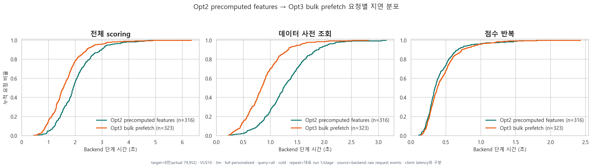
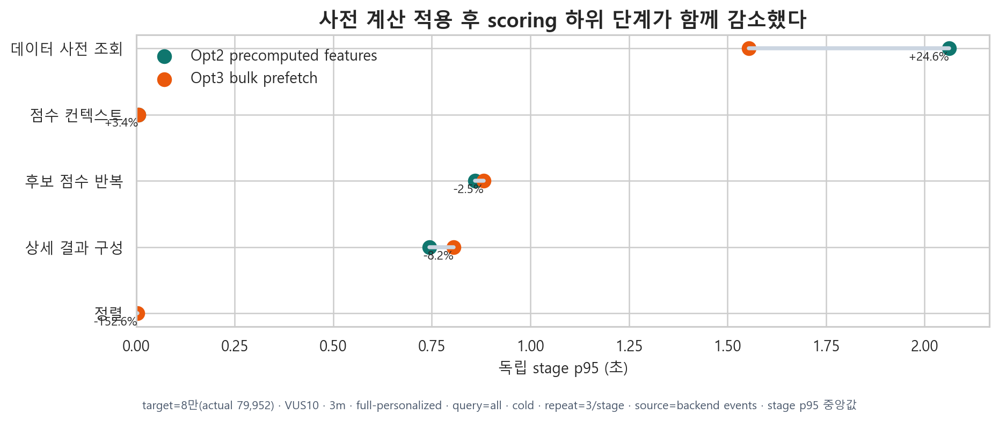
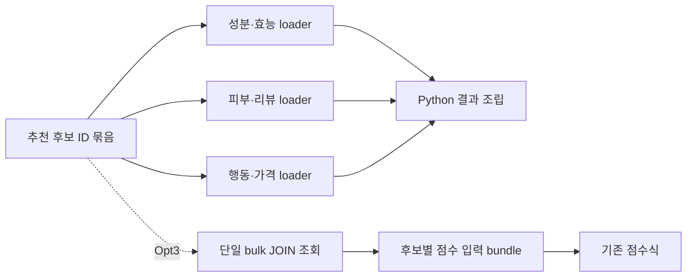

<!-- Generated by scripts/perf/generate_recommendation_performance_report.py. -->
# Opt3 bulk prefetch 측정 결과

## 관측과 선택

- 적용 변경: 후보 점수 데이터를 단일 bulk JOIN 경로로 통합
- 비교 대상: Opt2 precomputed features
- 조건: 79,952개 / full-personalized / VUS10 / 3분 / cold cache
- 상세 설계: [문서 보기](../../../../recommendation-bulk-prefetch.md)

## 관측

Opt2 이후 scoring 사전 조회 구간에서 후보별 점수 데이터 loader 비용이 남아 있다.

## 원인

동일 후보 집합에 필요한 관계 데이터를 여러 조회와 Python 조립 단계로 나눠 가져온다.

## 검토한 대안

완전한 상품 snapshot 테이블도 대안이지만 중복 데이터와 갱신 비용이 커서 측정 없이 먼저 도입하지 않는다.

## 기술 선택과 트레이드오프

bulk JOIN은 왕복 횟수를 줄이지만 행 폭과 중복 전송량이 커질 수 있어 batch 크기와 메모리를 함께 관찰해야 한다.

## 구현 구조

후보 ID 묶음을 기준으로 점수 입력 데이터를 한 번에 prefetch하고 기존 점수식에는 같은 구조를 전달한다.

## 동일 조건 결과

| 지표 | 이전 | 이후 | 변화 |
|---|---:|---:|---:|
| End-to-end p95 | 7.77초 | 7.38초 | +5.0% |
| 처리량 | 1.69 RPS | 1.74 RPS | +2.4% |
| Scoring p95 | 3.16초 | 2.72초 | +14.1% |
| 오류율 | 0.00% | 0.00% | 유지 |

## 요청별 분포

## 효과와 새로 드러난 병목

후보 일괄 조회로 scoring prefetch는 줄었지만 candidate retrieval과 score loop 비용이 다음 관찰 대상이다.

## 해석 범위

- ECDF는 backend 완료 이벤트의 요청별 표본이며 client end-to-end 분포가 아니다.
- 단계 p95는 각각 독립적으로 계산하며 합산하지 않는다.
- 대표 수치는 반복 run 중앙값이고 개별 값은 메인 안정성 그래프와 normalized CSV에 남긴다.
