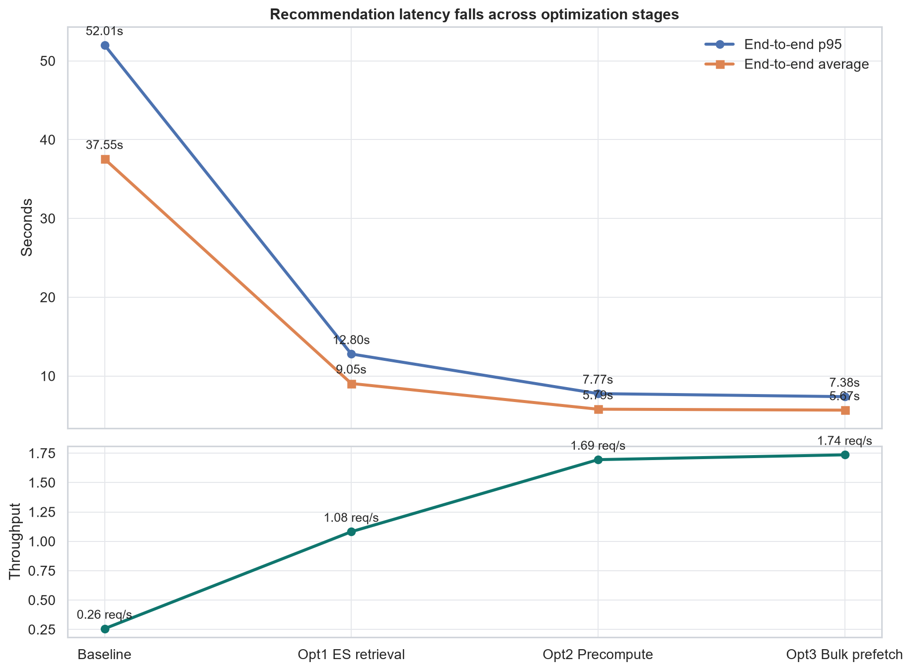
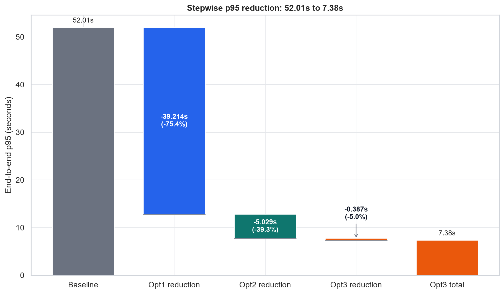
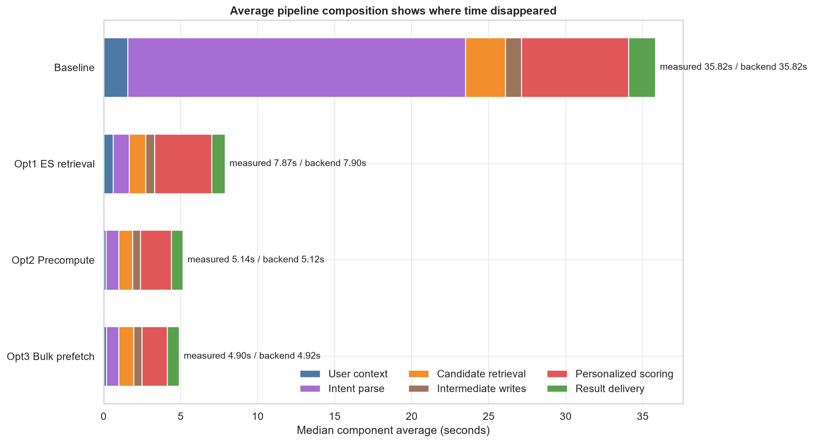
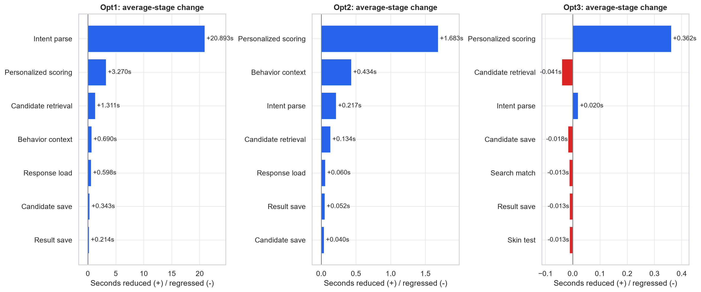
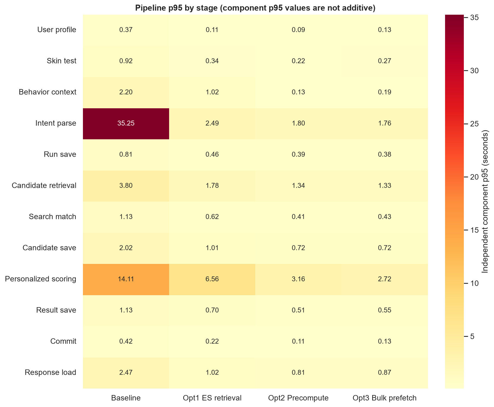
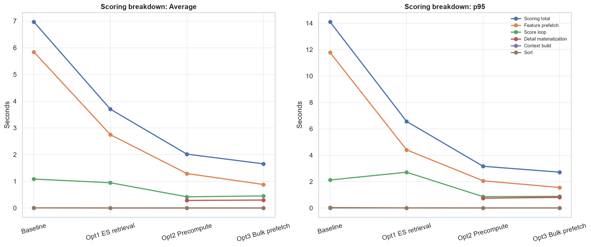
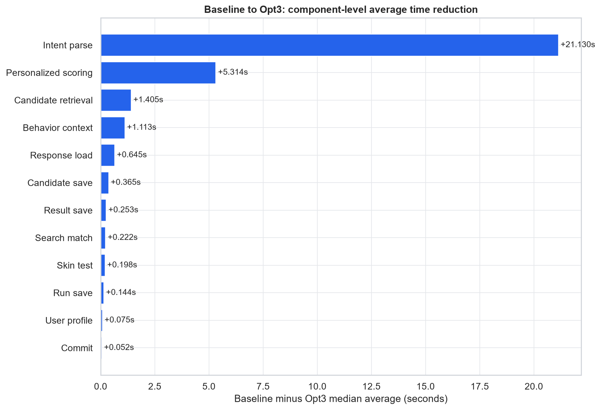

# 추천 성능 단계별 비교

8만 상품, VUS 10, 3분, full-personalized, cold cache 조건에서 Baseline부터 Opt3까지 비교한다.
단계 수치는 각 단계의 유효 run 중앙값이며, 원본 run과 해시는 `data/run-sources.csv`에서 확인할 수 있다.

## 결론

- End-to-end p95: **52,010.04 ms (52.010초) -> 7,380.36 ms (7.380초)**
- 총 감소: **44,629.68 ms (44.630초) (85.81%)**
- 처리량: **0.257 -> 1.736 req/s**

## 단계별 정확한 수치

| 단계 | run 수 | E2E 평균 | E2E p95 | Backend p95 | RPS | 오류율 |
|---|---:|---:|---:|---:|---:|---:|
| Baseline | 1 | 37,550.93 ms (37.551초) | 52,010.04 ms (52.010초) | 50,891.28 ms (50.891초) | 0.257 | 2.00% |
| Opt1 ES retrieval | 3 | 9,053.23 ms (9.053초) | 12,796.04 ms (12.796초) | 11,472.44 ms (11.472초) | 1.082 | 0.00% |
| Opt2 Precompute | 3 | 5,788.49 ms (5.788초) | 7,766.87 ms (7.767초) | 6,981.97 ms (6.982초) | 1.695 | 0.00% |
| Opt3 Bulk prefetch | 3 | 5,669.52 ms (5.670초) | 7,380.36 ms (7.380초) | 6,588.45 ms (6.588초) | 1.736 | 0.00% |

## 최적화 단계별 감소량

| 적용 단계 | E2E p95 이전 | E2E p95 이후 | 감소량 | 감소율 | 평균 감소 | RPS 증가율 |
|---|---:|---:|---:|---:|---:|---:|
| Opt1 | 52,010.04 ms (52.010초) | 12,796.04 ms (12.796초) | 39,214.00 ms (39.214초) | 75.40% | 28,497.70 ms (28.498초) | 321.15% |
| Opt2 | 12,796.04 ms (12.796초) | 7,766.87 ms (7.767초) | 5,029.16 ms (5.029초) | 39.30% | 3,264.74 ms (3.265초) | 56.67% |
| Opt3 | 7,766.87 ms (7.767초) | 7,380.36 ms (7.380초) | 386.52 ms (0.387초) | 4.98% | 118.97 ms (0.119초) | 2.42% |

## 파이프라인 요소별 평균 시간

양수 감소량은 빨라진 시간이고, 음수는 해당 단계에서 늘어난 시간이다.

| 구성요소 | Baseline | Opt1 | Opt2 | Opt3 | Opt1 감소 | Opt2 감소 | Opt3 감소 | 총 감소 |
|---|---:|---:|---:|---:|---:|---:|---:|---:|
| User profile | 114.25 ms | 39.86 ms | 31.47 ms | 39.46 ms | +74.39 ms | +8.39 ms | -7.99 ms | +74.79 ms |
| Skin test | 278.98 ms | 92.41 ms | 68.30 ms | 81.04 ms | +186.57 ms | +24.11 ms | -12.74 ms | +197.94 ms |
| Behavior context | 1,167.47 ms | 477.92 ms | 43.59 ms | 54.17 ms | +689.55 ms | +434.33 ms | -10.58 ms | +1,113.30 ms |
| Intent parse | 21,932.32 ms | 1,039.43 ms | 822.92 ms | 802.82 ms | +20,892.89 ms | +216.51 ms | +20.10 ms | +21,129.50 ms |
| Run save | 278.33 ms | 160.41 ms | 128.21 ms | 134.57 ms | +117.92 ms | +32.20 ms | -6.36 ms | +143.76 ms |
| Candidate retrieval | 2,182.72 ms | 871.29 ms | 737.33 ms | 777.96 ms | +1,311.43 ms | +133.96 ms | -40.63 ms | +1,404.76 ms |
| Search match | 403.89 ms | 203.96 ms | 168.86 ms | 182.32 ms | +199.93 ms | +35.10 ms | -13.46 ms | +221.57 ms |
| Candidate save | 759.95 ms | 417.45 ms | 377.02 ms | 394.97 ms | +342.50 ms | +40.43 ms | -17.95 ms | +364.98 ms |
| Personalized scoring | 6,969.28 ms | 3,699.74 ms | 2,016.55 ms | 1,654.98 ms | +3,269.54 ms | +1,683.19 ms | +361.57 ms | +5,314.30 ms |
| Result save | 517.25 ms | 303.33 ms | 251.68 ms | 264.48 ms | +213.92 ms | +51.65 ms | -12.80 ms | +252.77 ms |
| Commit | 94.02 ms | 46.70 ms | 37.70 ms | 41.83 ms | +47.32 ms | +9.00 ms | -4.13 ms | +52.19 ms |
| Response load | 1,117.08 ms | 518.67 ms | 458.99 ms | 471.61 ms | +598.41 ms | +59.68 ms | -12.62 ms | +645.47 ms |

## 스코어링 내부 평균 시간

| 구성요소 | Baseline | Opt1 | Opt2 | Opt3 | 총 감소 |
|---|---:|---:|---:|---:|---:|
| Scoring total | 6,969.28 ms | 3,699.74 ms | 2,016.55 ms | 1,654.98 ms | +5,314.30 ms |
| Feature prefetch | 5,843.95 ms | 2,746.17 ms | 1,290.75 ms | 881.28 ms | +4,962.67 ms |
| Score loop | 1,084.61 ms | 946.29 ms | 419.56 ms | 453.10 ms | +631.51 ms |
| Detail materialization | N/A | N/A | 284.18 ms | 298.19 ms | N/A |
| Context build | 4.22 ms | 1.97 ms | 1.36 ms | 1.77 ms | +2.45 ms |
| Sort | 5.05 ms | 1.65 ms | 1.07 ms | 1.24 ms | +3.81 ms |

## 각 단계에서 실제로 줄어든 병목

### Opt1

- Intent parse: 평균 **20,892.89 ms (20.893초) 감소**, 개별 p95 **32,764.27 ms (32.764초) 감소**
- Personalized scoring: 평균 **3,269.54 ms (3.270초) 감소**, 개별 p95 **7,544.65 ms (7.545초) 감소**
- Candidate retrieval: 평균 **1,311.43 ms (1.311초) 감소**, 개별 p95 **2,021.90 ms (2.022초) 감소**

### Opt2

- Personalized scoring: 평균 **1,683.19 ms (1.683초) 감소**, 개별 p95 **3,399.66 ms (3.400초) 감소**
- Behavior context: 평균 **434.33 ms (0.434초) 감소**, 개별 p95 **889.63 ms (0.890초) 감소**
- Intent parse: 평균 **216.51 ms (0.217초) 감소**, 개별 p95 **689.20 ms (0.689초) 감소**

### Opt3

- Personalized scoring: 평균 **361.57 ms (0.362초) 감소**, 개별 p95 **445.77 ms (0.446초) 감소**
- Intent parse: 평균 **20.10 ms (0.020초) 감소**, 개별 p95 **40.58 ms (0.041초) 감소**
- 회귀: Candidate retrieval 평균 **40.63 ms (0.041초) 증가**
- 회귀: Candidate save 평균 **17.95 ms (0.018초) 증가**

## 해석 주의사항

- E2E p95는 k6 요청 분포의 단계별 중앙값이다.
- 구성요소 평균은 같은 단계의 backend 계측 평균 중앙값이다. 평균 구성요소 감소량을 E2E p95 감소량과 직접 합산하지 않는다.
- 구성요소 p95는 각각 독립적으로 계산되므로 서로 더하면 전체 p95가 되지 않는다.
- Baseline은 유효 run이 1건이고 오류율이 2%여서 개선 전 문제 증거로만 사용한다.
- Opt1은 3건, Opt2는 3건, Opt3는 2건의 유효 run 중앙값이다.
- manifest의 git SHA가 `unknown`이므로 구현 단계는 registry의 명시적 run 연결로 증명한다.

## 원본 데이터

- `data/stage-summary.csv`
- `data/stage-transition-deltas.csv`
- `data/pipeline-component-metrics.csv`
- `data/pipeline-component-deltas.csv`
- `data/scoring-component-metrics.csv`
- `data/run-sources.csv`
