# 뭐바를래 서비스 화면 아카이브

> 캡처일: 2026-07-23
>
> 캡처 환경: 운영 서비스 `https://www.mubarelle.com/` 데스크톱 화면
>
> 목적: 운영 배포가 종료된 뒤에도 주요 사용자 화면과 서비스 흐름을 확인할 수 있도록 보존

이 문서는 실제 운영 화면을 브라우저로 순회하며 캡처한 기록입니다. 상품, 가격, 리뷰 수, 추천 결과처럼 데이터에 따라 달라지는 내용은 캡처 당시 상태이며 현재 코드나 API의 고정 계약을 의미하지 않습니다. 회원 화면은 테스트 계정으로 확인했고, 이메일과 인증 정보는 이미지에서 제거했습니다.

## 주요 사용자 흐름

```text
홈
→ 일반 검색 또는 AI 추천
→ 추천 결과와 변환 과정 확인
→ 상품 상세와 추천 근거 확인
→ AI 쇼핑 에이전트로 비교·탐색
→ 장바구니와 마이페이지
```

## 1. 홈

자연어 피부 고민을 입력하는 AI 추천 진입점과 인기 상품 큐레이션을 함께 보여주는 첫 화면입니다. 일반 검색과 AI 추천을 같은 검색 영역에서 전환할 수 있습니다.

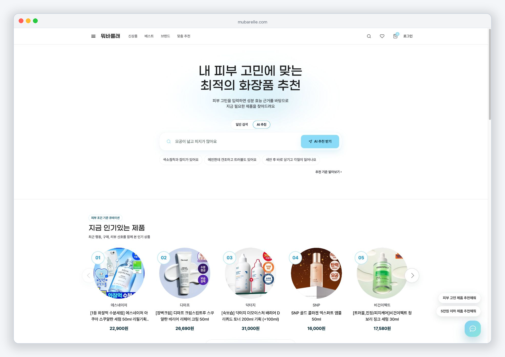

## 2. 로그인

이메일·비밀번호 로그인과 Google 간편 로그인을 제공합니다. 비회원도 공개 상품과 검색·추천 화면을 탐색할 수 있고, 회원 기능은 로그인 후 이어집니다.

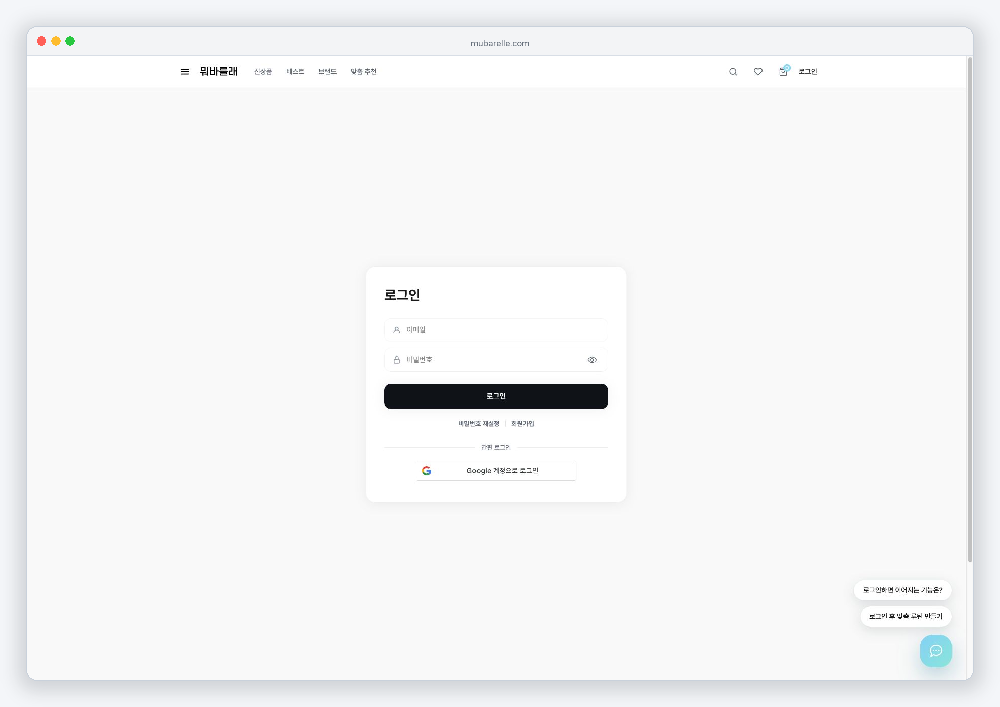

## 3. 피부 테스트 안내

로그인 후 피부 타입과 민감도를 보완할 수 있도록 짧은 피부 테스트를 안내합니다. 안내창을 닫거나, 테스트를 시작하거나, 7일 동안 보지 않도록 선택할 수 있습니다.

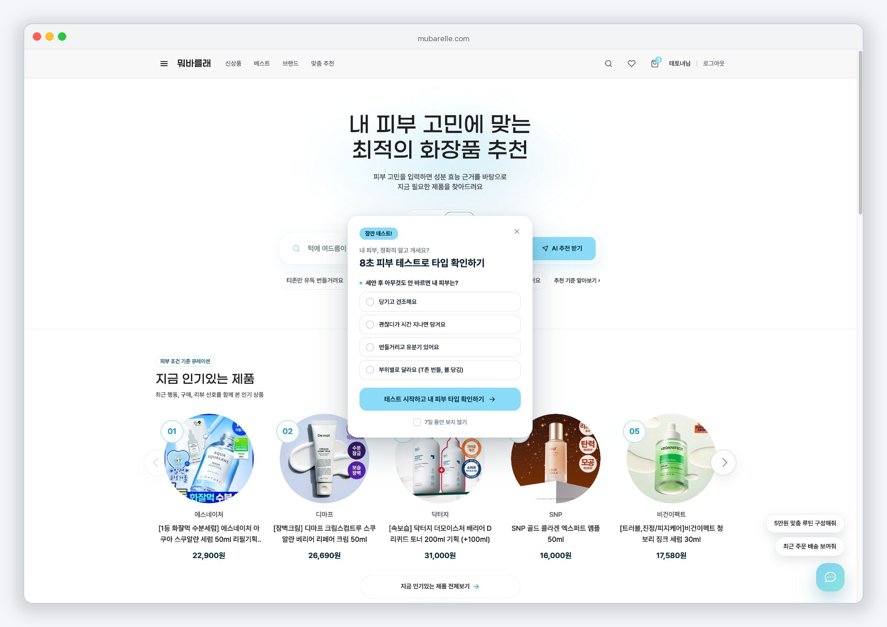

## 4. 베스트 상품

상품을 카테고리와 일간·주간·월간 기간으로 나누어 인기 순위 형태로 탐색하는 화면입니다.

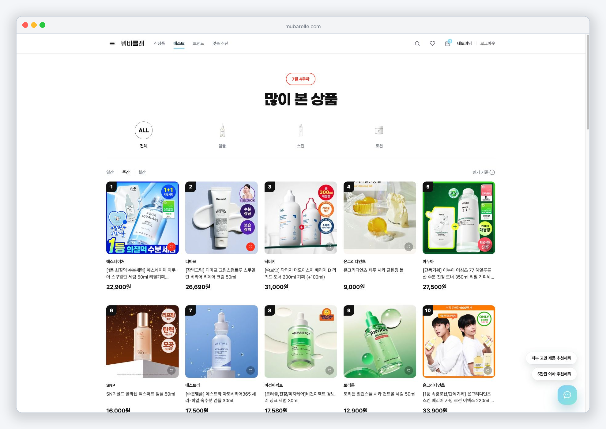

## 5. 브랜드 탐색

브랜드명과 보유 상품 수를 확인하고 원하는 브랜드를 검색하거나 선택할 수 있습니다.

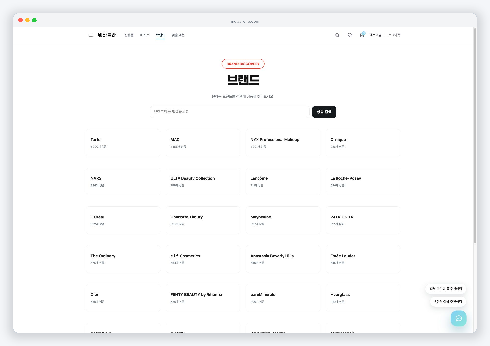

## 6. 피부 테스트 결과

테스트 결과에서 피부 타입, 민감도, 피부 고민과 추천 관리 키워드를 요약하고 맞춤 상품 탐색으로 연결합니다.

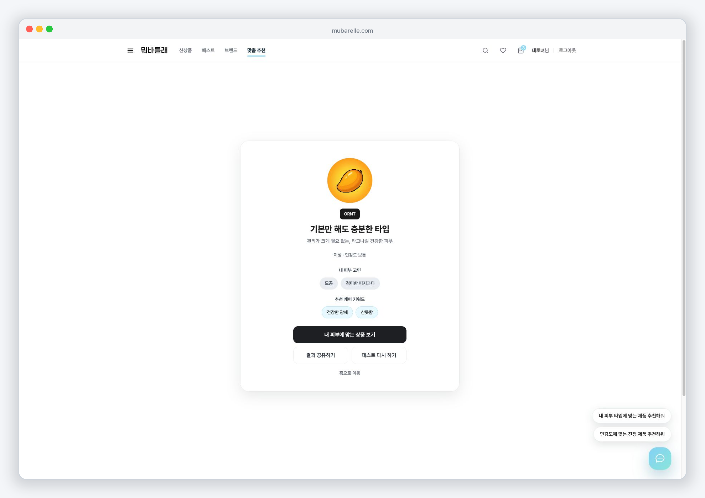

## 7. AI 추천 결과

입력 문장을 피부 고민, 필요한 효능, 핵심 성분과 상품 매칭 결과로 구조화합니다. 아래에는 해석된 조건과 상품별 매칭 점수를 함께 표시합니다.

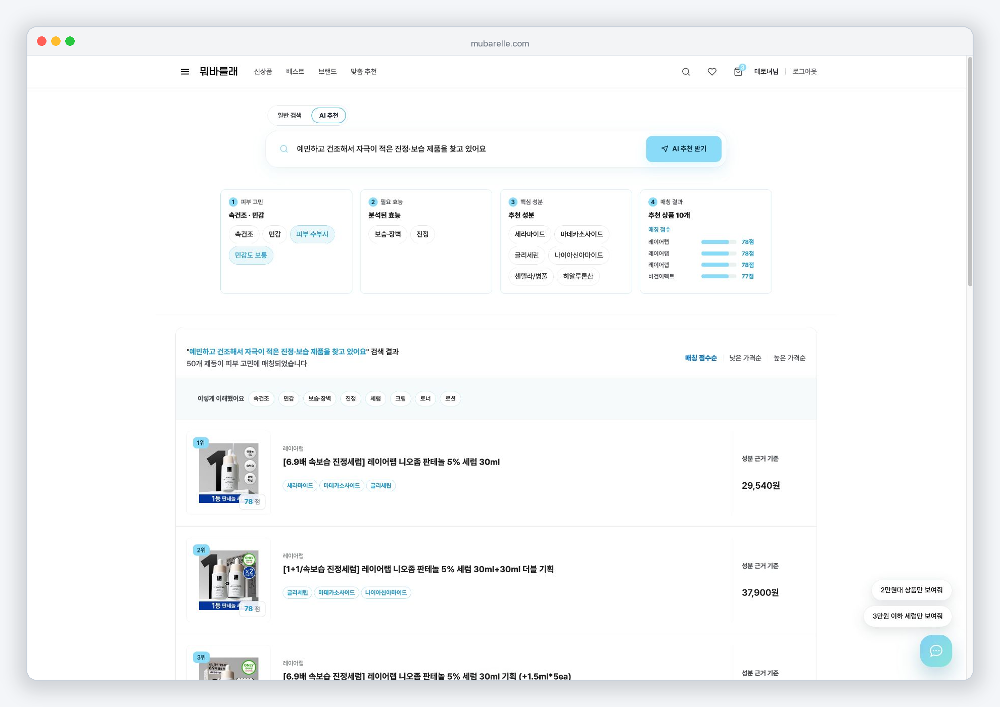

## 8. 상품 상세

상품 이미지, 가격, 평점, 리뷰 수와 구매 기능을 제공하며, 추천을 통해 들어온 경우 AI 추천 점수와 분석 진입점을 함께 보여줍니다.

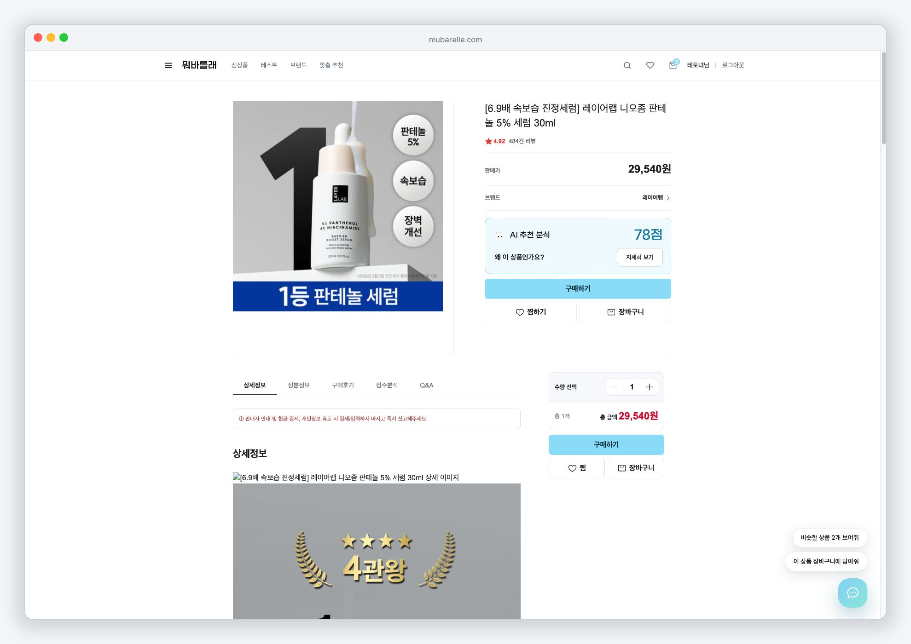

## 9. 추천 근거

상품 상세의 추천 분석 패널입니다. 입력 고민에서 필요한 효능, 선택 성분, 함량 상태와 근거 출처까지 이어지는 흐름을 한 화면에서 확인할 수 있습니다.

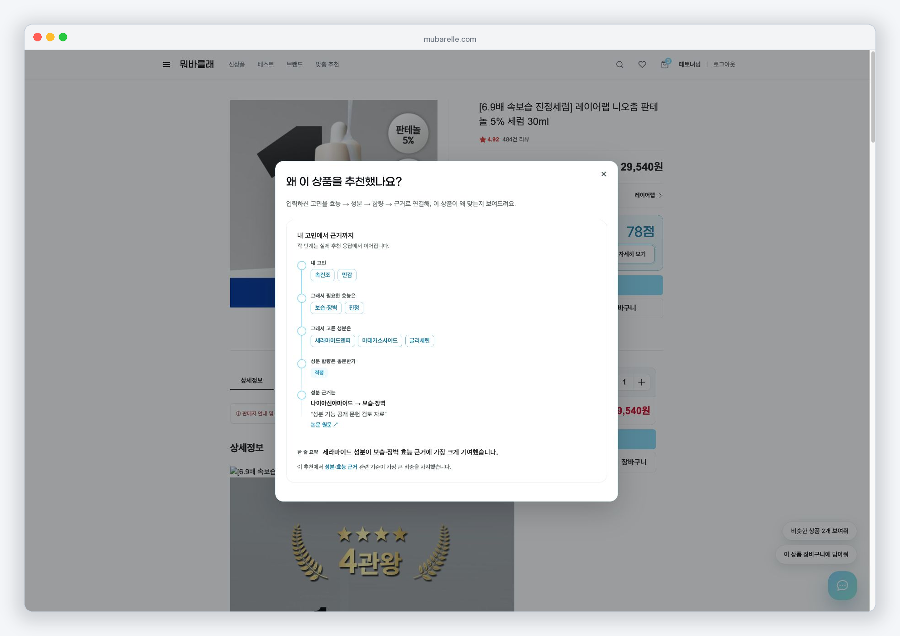

## 10. AI 쇼핑 에이전트

현재 상품과 직전 추천 결과의 화면 문맥을 이어받아 비교, 조건 재탐색과 장바구니 같은 쇼핑 기능으로 연결하는 대화형 패널입니다.

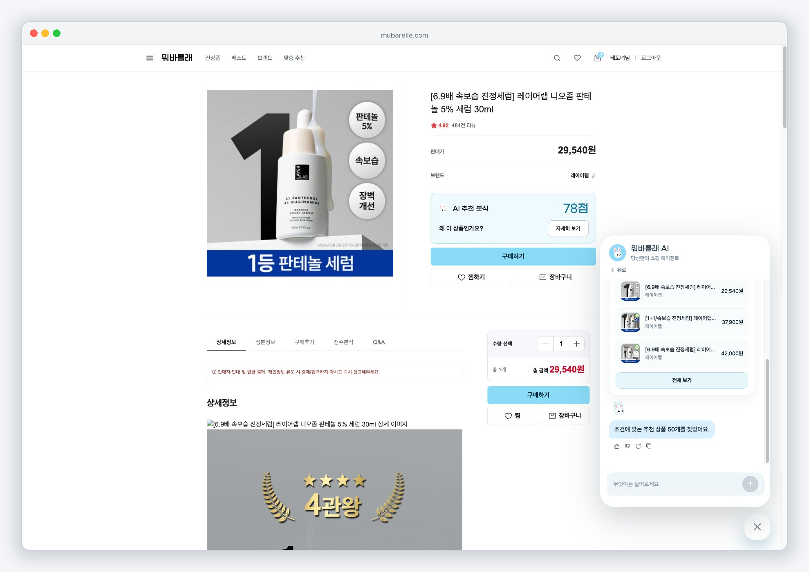

## 11. 장바구니

선택 상품의 수량, 재고 상태와 결제 예정 금액을 확인하고 주문서 단계로 이동하는 화면입니다.

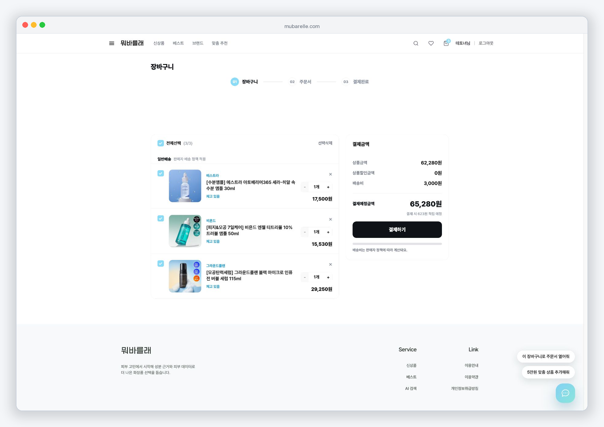

## 12. 일반 상품 검색

상품명, 브랜드와 성분으로 상품을 검색하고 관련도, 인기, 신상품, 가격과 평점 기준으로 정렬할 수 있습니다.

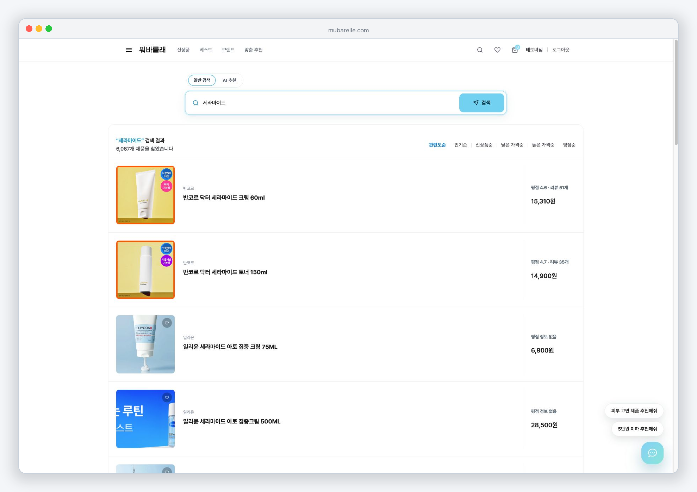

## 13. 마이페이지

피부 프로필, 피부 고민, 회피 성분, 피부 테스트 결과와 주문·배송 상태를 한곳에서 관리합니다. 캡처에 사용한 테스트 계정 이메일은 마스킹했습니다.

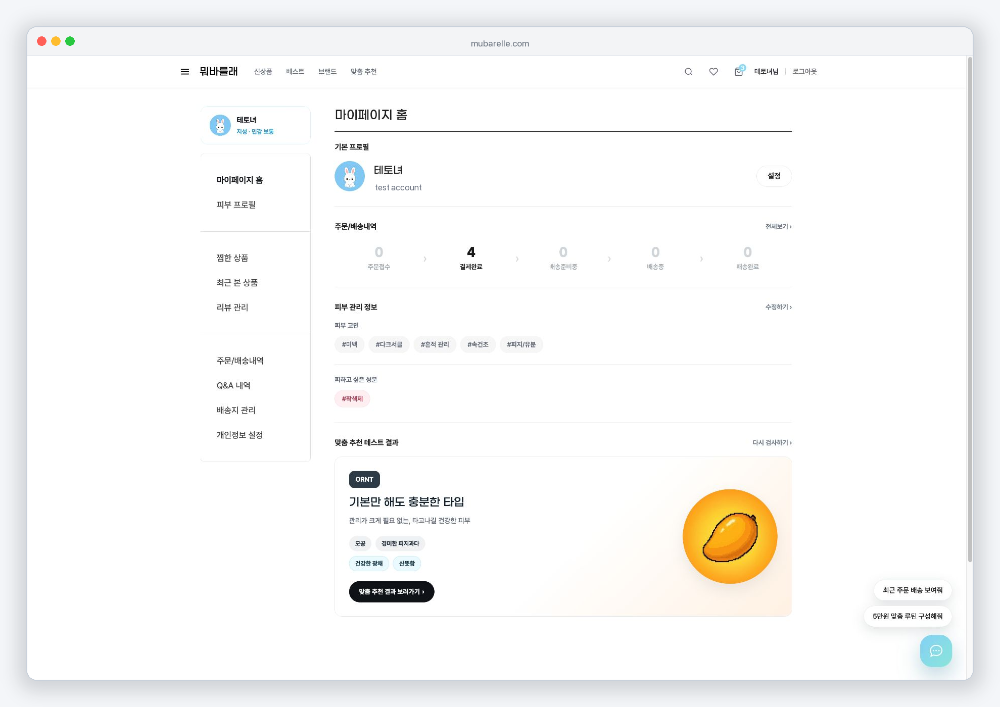

## 보존 범위

- 운영 화면의 대표 데스크톱 상태를 보존했습니다.
- 결제 실행, 주문 생성·취소와 배송지 화면은 외부 상태 변경 또는 개인정보 노출 가능성이 있어 포함하지 않았습니다.
- 모바일·태블릿 반응형 화면과 관리자 화면은 이 문서의 범위에 포함하지 않았습니다.
- 화면의 동작 방식과 최신 API 계약은 저장소의 코드 및 `docs/api/` 문서를 기준으로 확인합니다.
